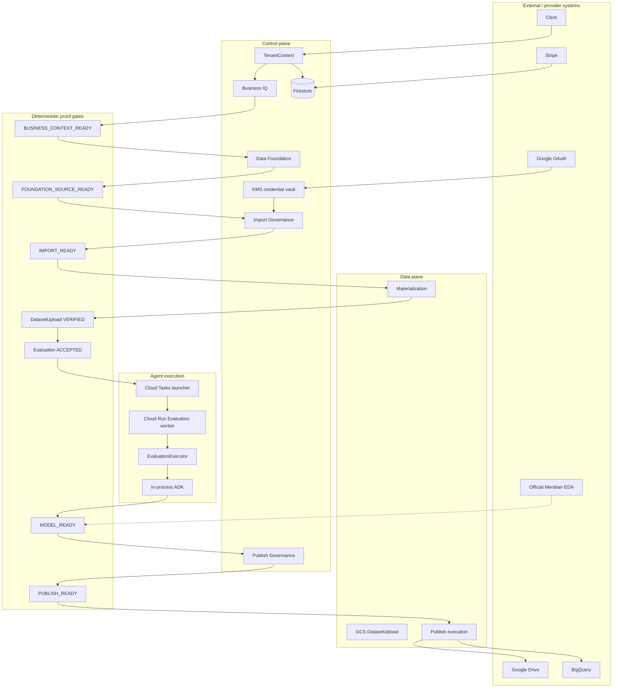

# Mission 2 backend acceptance freeze

Canonical Mission 2 backend acceptance document.

This freeze adds no product capability, no architecture, and no readiness-semantic change.
It reconciles the completed Mission 2 source graph into one reviewable merge candidate.

**Terminal for this mission:** `MERGE_READY`, not `MERGED`.
The operator decides whether to merge.

Proof language is defined in `docs/backend/M2_ACCEPTANCE_PROOF_MATRIX.md`.
This report never uses bare `PASS` as a cloud/provider claim.

---

## A. Product boundary

PreM3 is the autonomous pre-modeling product. Mission 2 backend architecture is the
authenticated service that turns verified tenant authority into governed Evaluation and
publish-ready evidence.

Mission 2 backend **does** own:

- Clerk → TenantContext mapping
- Business IQ and `BUSINESS_CONTEXT_READY`
- Data Foundation and `FOUNDATION_SOURCE_READY` / `DATA_FOUNDATION_READY`
- Google connection/binding architecture and KMS vault
- `IMPORT_READY` / materialization into immutable `DatasetUpload`
- Evaluation `ACCEPTED` + durable Cloud Tasks dispatch + Cloud Run worker
- Deterministic `MODEL_READY` gates
- `PUBLISH_READY` and Drive/BigQuery publish adapters
- Public OpenAPI / JSON Schema contracts
- Tenant isolation and model-authority constraints

Mission 2 backend **does not** own:

- Interactive Clerk Organization UX
- Interactive Google account picker
- Frontend visual implementation
- Google Sheets ingestion
- Production-scale BigQuery extraction beyond 100,000 rows
- Meridian model fitting / posterior sampling
- Run-based billing
- SSE / WebSockets
- Taskmaster UI redesign
- Proprietary model training

---

## B. Final architecture

```text
Clerk / tenant authority
    → Business IQ
    → BUSINESS_CONTEXT_READY
    → Data Foundation
    → FOUNDATION_SOURCE_READY
    → M2-11 Import Governance
    → IMPORT_READY
    → M2-12 governed materialization
    → VERIFIED DatasetUpload
    → Evaluation ACCEPTED
    → M2-13 durable dispatch
    → Cloud Tasks prem3-evaluation-dispatch
    → Cloud Run Evaluation Job prem3-evaluation-worker
    → SERVICE TenantContext
    → ExecutionContext
    → in-process ADK
    → Pre-Modeling
    → MODEL_READY when all deterministic gates pass
    → PUBLISH_READY
    → governed Drive / BigQuery publishing
```

No FastAPI `BackgroundTasks`. No detached asyncio Evaluation. No ADK HTTP surface.
No `/run_sse`. No browser execution authority.



---

## C. Git / source graph

| Field | Value |
|---|---|
| MAIN_BASE_SHA | `a098e2cdb36b11d1c9f81790be941b913be117c6` |
| PR15 freeze | `foundational-intake-freeze-2026-08-22-v1` |
| M12Q_SHA | `56116b74372a5a96a441fedc7d3d8411abf79299` |
| M13_SHA | `797f294923f55cbcf441a6afe30b3c186ce25691` |
| M12_ORIGINAL_SHA | `19d77902f00de5098209556c526cf184a8162586` |
| M12_SAFETY_REF | `backup/prem3-m2-materialization-publish-19d779` |
| M14_BRANCH | `feature/prem3-m2-acceptance-freeze` |
| REMOTE_BRANCH | `feature/prem3-m2-acceptance-freeze` |

Verified ancestry:

```text
a098e2c  (origin/main / PR15)
    → 56116b7  (M2-12Q)
        → 797f294  (M2-13 final)
```

No historical Mission 2 branch was rewritten for this freeze.

---

## D. Deployed runtime graph

| Field | Value |
|---|---|
| DEPLOYED_API_SHA | `757f8161627a346d071214397ab045e056a07512` |
| FINAL_M13_SHA | `797f294923f55cbcf441a6afe30b3c186ce25691` |
| WORKER_SOURCE_SHA | `caf794d` |
| DEPLOYED_SOURCE_ANCESTRY | `757f816` is an ancestor of `797f294` |
| RUNTIME_DELTA_AFTER_DEPLOY | none |
| API_REVISION | `prem3-api-00008-br6` |
| API_IMAGE_DIGEST | `sha256:a731a6e59027f49fdcc9cecb6880bab4e00f186fa8853f8932a096fda6ed74cf` |
| WORKER_JOB | `prem3-evaluation-worker` |
| WORKER_IMAGE_DIGEST | `sha256:fd430a73301660704de57b741228842a8a96495c4e2a6afe43b742a10ef896f3` |
| API_URL | `https://prem3-api-vkcd3cbiea-uc.a.run.app` |
| QUEUE | `prem3-evaluation-dispatch` / `us-central1` / RUNNING |
| DISPATCHER_SA | `prem3-evaluation-dispatcher@modelready-m3.iam.gserviceaccount.com` |
| RUNTIME_SA | `m3-runtime@modelready-m3.iam.gserviceaccount.com` |
| EDA_JOB | `meridian-eda-worker` |

`git log 757f816..797f294` is only:

```text
797f294 docs: record M2-13 cloud Evaluation dispatch proofs
```

That delta is **DOCUMENTATION** only (`docs/backend/M2_13_DURABLE_EVALUATION_DISPATCH_COMPLETION_REPORT.md`).
Existing cloud proof remains valid. No API or worker redeploy is required for this freeze.

Worker image was built from `caf794d`. Later commits through `797f294` change the
**API launcher** LRO behavior (`app/service/evaluation_jobs.py`), tests, qualify script,
and docs. Worker execution semantics are unchanged. The launcher-LRO fix lives in
`prem3-api` (`757f816`), which is the deployed API revision.

Resources inventoried read-only. No cloud mutation for inventory.

Proven Dataset A SERVICE fixture remains:

| Field | Value |
|---|---|
| dispatch_id | `dsp_4898db7dd78d42568edf` |
| run_id | `run_e6536dd22eb24a4793e0` |
| tenant_id | `ten_200b244b3d2e4f91bab0` |
| dispatch status | `SUCCEEDED` |
| attempt_count | `1` |
| Cloud Run execution | `prem3-evaluation-worker-pjl9v` |

---

## E. Public API freeze

Public liveness: `GET /health` (`getHealth`).
Public readiness: `GET /readyz` (`getReady`).
`/healthz` is not added.

`/readyz` reports `control_plane`, `auth_provider`, and `billing_provider` configuration.
It is not full downstream provider health.

Customer-facing domains remain:

- catalog
- `/me`
- workspaces
- datasets
- uploads
- evaluations / runs
- Business IQ
- Data Foundation
- billing
- Google connections / bindings
- Import Governance
- materializations
- publish governance / execution

Public OpenAPI operation count at freeze: **100**.
Internal launch is **not** in public OpenAPI.

Internal route (documented separately, `include_in_schema=False`):

```text
POST /internal/v1/evaluation-dispatches/{dispatch_id}/launch
```

OIDC audience:

```text
https://prem3-api-vkcd3cbiea-uc.a.run.app/internal/v1/evaluation-dispatches
```

Customer Clerk tokens are denied. Cloud Tasks headers are metadata, not authority.

Operation IDs are frozen. No aesthetic renames.

---

## F. State vocabulary

No generic `READY` state replaces the following.

| State | Owner | Implication |
|---|---|---|
| `BUSINESS_CONTEXT_READY` | `evaluateBusinessContextReady` / Business IQ | Snapshot is sufficient for DF discovery. Not a source or import state. |
| `FOUNDATION_SOURCE_READY` | `evaluateDataFoundationSourceReady` | One DF-managed source is foundation-ready. Not workspace-ready. Not import-ready. |
| `DATA_FOUNDATION_READY` | `evaluateDataFoundationReady` | Workspace-level DF environment is ready. Not required per source for import. |
| `IMPORT_READY` | `evaluate_import_readiness` | Selected objects may be materialized. Not a verified upload. |
| `VERIFIED` | `UploadService.complete_upload` | Immutable `DatasetUpload` package exists. Not Evaluation acceptance. |
| `ACCEPTED` | `createEvaluation` | Execution authority exists. Not dispatch running. Not MODEL_READY. |
| `PENDING` / `QUEUED` / `LAUNCHING` / `RUNNING` | `EvaluationDispatch` | Transport lifecycle. Not EvaluationStatus. |
| `SUCCEEDED` | `EvaluationDispatch` | Worker finished transport successfully. Not MODEL_READY. |
| `FAILED_RETRYABLE` / `FAILED_TERMINAL` | `EvaluationDispatch` | Launch/execution failed. Not a readiness state. |
| `MODEL_READY` | Deterministic pre-modeling validators + official Meridian EDA | Terminal pre-modeling success. Not publish. |
| `PUBLISH_READY` | `evaluate_publish_readiness` | Destinations may receive MODEL_READY artifacts. Not published. |
| `COMPLETE` / `PARTIAL` / `FAILED` | `PublishExecutionService` | Publish execution result. `COMPLETE` is published; `PUBLISH_READY` is not. |

Materialization transport states (`REVALIDATING`, `COPYING`, `VERIFYING`, `COMPLETE`, `FAILED`)
are copy/verify lifecycle, not readiness.

Hard inequalities:

```text
BUSINESS_CONTEXT_READY ≠ FOUNDATION_SOURCE_READY
FOUNDATION_SOURCE_READY ≠ DATA_FOUNDATION_READY
FOUNDATION_SOURCE_READY ≠ IMPORT_READY
IMPORT_READY ≠ VERIFIED
VERIFIED ≠ Evaluation ACCEPTED
ACCEPTED ≠ dispatch RUNNING
dispatch SUCCEEDED ≠ MODEL_READY
MODEL_READY ≠ PUBLISH_READY
PUBLISH_READY ≠ PUBLISHED / publish COMPLETE
```

`STATE_COLLAPSE_FOUND=false`

---

## G. Evidence / proof vocabulary

Allowed states: `PROVEN_LOCAL`, `PROVEN_CLOUD`, `IMPLEMENTED_NOT_LIVE_QUALIFIED`,
`DEFERRED_UI_PROVIDER_QUALIFICATION`, `EXTERNAL_DEPENDENCY`, `NOT_RUN`, `FAILED`.

Canonical matrix: `docs/backend/M2_ACCEPTANCE_PROOF_MATRIX.md`.

Evidence spine (no additional manifest layer):

```text
BusinessProfileSnapshot
    → EvidenceRequirement
    → SourceBinding
    → SourceFoundationReceipt
    → PreM3ImportContractV1
    → ImportReadinessReceipt
    → SourceMaterializationReceipt
    → DatasetUpload manifest
    → Evaluation
    → MODEL_READY evidence
    → PreM3PublishContractV1
    → PublishReadinessReceipt
    → PublishExecutionReceipt
```

---

## H. Business IQ

Canonical and persisted. `BUSINESS_CONTEXT_READY` is deterministic.
Local proof: `PROVEN_LOCAL`. Cloud interactive proof is not required to freeze architecture.

---

## I. Data Foundation

Canonical and persisted. `FOUNDATION_SOURCE_READY` and `DATA_FOUNDATION_READY` remain distinct.
Namespace authority: `app/data_foundation/owned_resources.py`.

Protected names include `stg_*`, `canonical_*`, `source_registry`, `source_health`,
`model_input_mmm`, and other owned tables. Mission 2 publish may not overwrite them.

---

## J. Import Governance

`IMPORT_READY` remains evaluator-owned. Source revalidation stays fail-closed.
Stale provider identity after `IMPORT_READY` cannot silently rematerialize.

---

## K. Materialization

GCS_UPLOAD, Drive, and bounded BigQuery adapters are implemented.
`BIGQUERY_MATERIALIZATION=PASS_BOUNDED`. `BIGQUERY_MAX_ROWS=100000`.
`PRODUCTION_SCALE_BIGQUERY_MATERIALIZATION=false`.

Source above the bound → explicit `MATERIALIZATION_LIMIT_EXCEEDED`.
Never silent `LIMIT 100000`.

Live Drive/BQ provider proofs remain deferred.

---

## L. Evaluation

`DatasetEvaluationRef.status` / `EvaluationStatus` is only `ACCEPTED`.
Execution states are not added to EvaluationStatus.

`EvaluationDispatch` owns transport. `DurableRunState` / readiness receipts own pipeline
outcome. Frontend polls `GET /v1/runs/{run_id}`.

Public `EvaluationExecutionView` may expose:

`run_id`, `evaluation_status`, `dispatch_status`, timestamps, `current_stage`,
`terminal`, `outcome`, `model_ready`, `approval_required`, `issue_count`,
readiness/EDA receipt availability.

It must not expose `package_uri`, GCS paths, Cloud Task names, Cloud Run LRO,
tenant authority, raw exceptions, or credentials.

---

## M. Durable Dispatch

```text
createEvaluation
    → Evaluation + EvaluationDispatch
    → Cloud Tasks prem3-evaluation-dispatch
    → service-authenticated internal launch
    → Cloud Run Jobs API
    → prem3-evaluation-worker
    → atomic dispatch claim
    → SERVICE TenantContext
    → EvaluationExecutor.execute_evaluation(run_id)
    → ExecutionContext
    → in-process ADK
```

Launcher rule (frozen): start the Job, obtain the execution name, persist launch
identity, return immediately. It must not wait for the Job LRO to finish.

Regression: `tests/unit/test_m2_13_evaluation_dispatch.py::test_cloud_run_launcher_does_not_wait_for_job_completion`.

`DUPLICATE_DISPATCH_FAIL_CLOSED` is `PROVEN_CLOUD` (`attempt_count=1`).
`LOCAL_RETRY_CLAIM_PROOF` is `PROVEN_LOCAL`.
`CLOUD_EVALUATION_RETRY_PROOF` is `NOT_RUN`.

---

## N. MODEL_READY

Semantics unchanged. Agent prose never decides `MODEL_READY`.

| Proof | State |
|---|---|
| HISTORICAL_DATASET_A_MODEL_READY | `PROVEN_CLOUD` (historical qualified path) |
| DURABLE_WORKER_AUTHORIZED_ADK | `PROVEN_CLOUD` |
| DURABLE_WORKER_MODEL_READY | `EXTERNAL_DEPENDENCY` |

Dispatch `SUCCEEDED` is not `MODEL_READY`. Official Meridian EDA is not bypassed.

---

## O. Publish Governance

`PUBLISH_READY` is distinct from `MODEL_READY` and from publish `COMPLETE`.
Drive and BigQuery adapters are implemented. Live provider proofs are deferred.

Versioned publish remains `model_ready_{dataset_id}_{run_id}`.
Current pointer remains `model_ready_{dataset_id}_current`.

---

## P. Google / KMS

OAuth architecture, Drive/BQ bindings, and KMS envelope `aes-256-gcm+kms-v1` remain.
Google subject/email is never PreM3 tenant.

Canonical Drive root: `prem3-modeling` (folder ID is authority).
Conceptual folders (`sources`, `business_data`, `evidence`, `imports`, `exports`,
`reports`, `system`) coexist under that one root. No second root.

Canonical customer BQ dataset: `prem3_modeling` (friendly name `prem3-modeling`).
Data Foundation assets stay distinct from Mission 2 model-ready publish assets.

---

## Q. IAM

| Principal | Resource | Role | Reason |
|---|---|---|---|
| `m3-runtime@...` | queue `prem3-evaluation-dispatch` | `roles/cloudtasks.enqueuer` | enqueue launch tasks |
| `m3-runtime@...` | SA `prem3-evaluation-dispatcher@...` | `roles/iam.serviceAccountUser` | specify OIDC identity |
| `prem3-evaluation-dispatcher@...` | token mint only | Cloud Tasks OIDC identity | invoke internal launch |
| `m3-runtime@...` | job `prem3-evaluation-worker` | `roles/run.jobsExecutorWithOverrides` | start one job with dispatch override |
| `m3-runtime@...` | KMS key `prem3-google-oauth-credentials` | `roles/cloudkms.cryptoKeyEncrypterDecrypter` | wrap/unwrap Google DEKs |
| `m3-runtime@...` | required Secret Manager secrets | `roles/secretmanager.secretAccessor` | Clerk / Stripe / OAuth config |
| `m3-runtime@...` | Firestore | `roles/datastore.user` | control plane |
| `m3-runtime@...` | GCS / BigQuery / Vertex / EDA job | existing scoped roles | artifacts, publish, isolated EDA |

`BROAD_RUNTIME_IAM=0`. No Owner, Editor, Cloud Run Admin, KMS Admin, or Secret Manager Admin
on the runtime identity. M2-14 did not broaden IAM.

Secret inventory (names only; no values):

- Clerk secret key
- Clerk webhook signing secret
- Google OAuth client secret
- Stripe test secret
- KMS-protected dynamic Google refresh tokens

`SECRET_LEAKAGE=false` for this freeze: no secret values in git, OpenAPI, JSON Schema,
or completion docs.

---

## R. Multi-tenancy

```text
user ≠ tenant
Clerk org ≠ PreM3 tenant authority ID
Google subject ≠ tenant
Google email ≠ tenant
workspace ≠ tenant
dataset ≠ run
```

Tenant isolation is enforced on Business IQ, Data Foundation, uploads, evaluations,
dispatches, Google connections, materializations, and publishes.
Cross-tenant lookup remains safe not-found.

`MODEL_AUTHORITY_EXPANDED=false`. Root-agent tool schemas still reject tenant, workspace,
dataset, upload, run, dispatch, package URI, GCS path, Drive/BQ destination, entitlement,
Cloud Task, and Cloud Run execution identity as model-callable parameters.

---

## S. MEL

Local `EXPERIENCE_LEARNED` path unchanged.
Sealed Dataset C `EXPERIENCE_APPLIED` proof unchanged.
No new cloud learning-pair claim.
No M2-13 dispatch artifact enters the learning/training corpus.

---

## T. Dataset A / B / C regression

| Dataset | Required freeze | State |
|---|---|---|
| A Music Center | fingerprint `7cfc15152067923b6ec6d2b77d6b4e4fae16b748eae24deb250939e7458fe18f` | unchanged; historical `MODEL_READY` |
| B Stride & Field | `WAITING_FOR_APPROVAL` / `APPROVAL_REQUIRED` | unchanged |
| C Summit & Pine | `SEALED_HOLDOUT` / `HOLDOUT_QUALIFICATION_ONLY` | unchanged; no MEL contamination |

---

## U. Contract hashes

Computed on the freeze candidate after regeneration/check (see section V).
Do not hand-edit OpenAPI or schema files.

| Field | Value |
|---|---|
| OPENAPI_SHA256 | `05e21cf073b3f2d8d82359f9b0cbcd5bd6977c96195be3156a9d7c6b52fc271b` |
| SCHEMA_MANIFEST_SHA256 | `734f528d59ea5bc38d35c222f34d31c67109dc53cc8f9c3cac1438c3afa7516a` |
| PUBLIC_OPERATION_COUNT | `100` |
| INTERNAL_OPERATION_COUNT | `1` (launch; excluded from public OpenAPI) |
| CONTRACT_DRIFT | must be none on the freeze SHA |

Frontend consumes generated/frozen contracts. Frontend must not invent readiness semantics.

Frontend handoff: `docs/backend/M2_14_FRONTEND_CONTRACT_HANDOFF.md`.

---

## V. Test gates

Required local suite from mission §38 plus remote CI on the exact remote freeze SHA.

| Gate | Result |
|---|---|
| RUFF | PASS |
| OPENAPI_DRIFT | none |
| SCHEMA_DRIFT | none |
| UNIT_TESTS | PASS |
| INTEGRATION_TESTS | PASS (`data_foundation -k not meridian_eda`; `integration -k not bigquery and not meridian_eda`) |
| REGRESSION_TESTS | PASS |
| TENANCY / CLERK / STRIPE / BIQ / DF / GOVERNANCE / DISPATCH / AUTHORITY | PASS |
| PRECLOUD_CHECK | READY_FOR_CLOUD_RUN |
| FRONTEND_LINT | PASS |
| FRONTEND_TYPECHECK | PASS |
| FRONTEND_TEST | PASS (84) |
| FRONTEND_BUILD | PASS |
| NEW_FAILURES_FROM_THIS_MISSION | 0 |

Remote CI is recorded on the exact pushed freeze SHA after the PR opens.

---

## W. Cloud proof matrix

| Proof | State |
|---|---|
| CLOUD_API_ALIVE | true |
| CLOUD_DURABLE_EVALUATION_DISPATCH | true |
| CLOUD_EVALUATION_JOB_LAUNCHED | true |
| CLOUD_AUTHORIZED_ADK_EXECUTION | true |
| CLOUD_MODEL_READY_EVALUATION | false / EXTERNAL_DEPENDENCY |
| CLOUD_EVALUATION_RETRY_PROOF | NOT_RUN |
| DUPLICATE_DISPATCH_FAIL_CLOSED | PROVEN_CLOUD |

These values are preserved from M2-13. M2-14 does not upgrade them.

---

## X. Deferred UI / provider proofs

All remain `DEFERRED_UI_PROVIDER_QUALIFICATION`. They are not architecture gaps.

- LIVE_CLERK_CLOUD_IDENTITY_PROOF
- LIVE_GOOGLE_OAUTH_PROOF
- LIVE_GOOGLE_DRIVE_CONNECTION_PROOF
- LIVE_GOOGLE_BIGQUERY_CONNECTION_PROOF
- LIVE_DRIVE_MATERIALIZATION_PROOF
- LIVE_BIGQUERY_MATERIALIZATION_PROOF
- LIVE_DRIVE_PUBLISH_PROOF
- LIVE_BIGQUERY_PUBLISH_PROOF

Do not call them `PROVEN`. Do not call them `FAILED`.

---

## Y. External dependencies

1. Interactive frontend-backed Clerk/Google provider qualification.
2. Live Drive materialization/provider proof.
3. Live BigQuery materialization/provider proof.
4. Live Drive/BQ publish provider proof.
5. New durable-worker `MODEL_READY` cloud proof requiring official Meridian EDA.
6. Production-scale BigQuery materialization beyond 100,000 rows.

---

## Z. Explicit non-goals / future work

Not required to close Mission 2 backend:

- frontend visual implementation
- interactive Google account picker UI
- Google Sheets direct ingestion
- production-scale BQ extraction worker
- Meridian model fitting
- posterior modeling
- new MMM modeling advisor
- run-based billing
- SSE / WebSockets
- Taskmaster UI redesign
- proprietary model training

After this freeze, next workstreams are:

1. **Frontend integration** — Clerk org UX, Business IQ, Data Foundation, source connection,
   IMPORT_READY, materialization, Evaluation polling, MODEL_READY, PUBLISH_READY / publish UX.
2. **End-to-end provider qualification** — live Clerk, Google OAuth, Drive, BigQuery,
   stale-source proofs, publish proofs.
3. **Modeling / post-premodel product work** — outside Mission 2.

Do not start M2-15 backend architecture unless a genuine blocker is found.

Recommended post-merge tag: `prem3-m2-backend-freeze`.
Do not create a pre-merge release tag.

---

## Acceptance invariants

| Invariant | Freeze |
|---|---|
| Business IQ canonical and persisted | yes |
| BUSINESS_CONTEXT_READY deterministic | yes |
| Data Foundation canonical and persisted | yes |
| FOUNDATION_SOURCE_READY deterministic | yes |
| DATA_FOUNDATION_READY distinct | yes |
| IMPORT_READY deterministic | yes |
| source revalidation fail-closed | yes |
| immutable DatasetUpload boundary | yes |
| Evaluation ACCEPTED distinct from execution | yes |
| durable Cloud Tasks dispatch | yes |
| Cloud Run Evaluation worker | yes |
| service TenantContext restoration | yes |
| EvaluationExecutor reused | yes |
| cloud-authorized ADK execution proven | yes |
| duplicate dispatch fail-closed | yes |
| MODEL_READY semantics unchanged | yes |
| PUBLISH_READY distinct | yes |
| Drive/BQ publish adapters implemented | yes |
| KMS credential vault | yes |
| tenant isolation | yes |
| model authority unchanged | yes |
| MEL unchanged | yes |
| Dataset A/B/C regressions | yes |
| OpenAPI frozen | yes |
| schema frozen | yes |
| IAM reviewed | yes |
| deferred provider proofs explicit | yes |
| external dependencies explicit | yes |
| no false proof claims | yes |

---

## Operator return (filled after freeze commit + CI)

See the M2-14 operator return block in the pull request and chat closeout.
This report is the architectural freeze; CI/SHA fields are completed on the exact
remote candidate.
