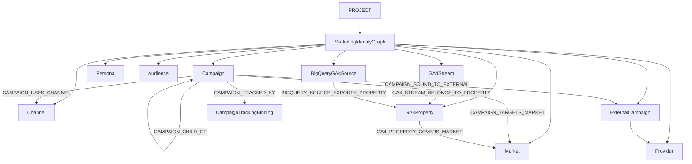

# Marketing Identity Graph architecture

**Mission:** IG-00 architecture freeze + IG-01 canonical market identity and GA4 topology + IG-02 Campaign Ledger + IG-02A Audience + Persona Ledger + IG-03 external bindings, observation, and verification  
**Domain:** `app/identity_graph/`

```text
FOUNDATION
├── Business IQ
├── Data Foundation
└── Identity Graph
    ├── Markets
    ├── Channels
    ├── Campaigns
    ├── Audiences
    ├── Personas
    ├── Providers / Platforms
    └── Source identities
```

The PreM3 Identity Graph models marketing execution identities and business marketing entities. It does not model or persist individual consumer/person identity.

| Term | Meaning |
|---|---|
| **Persona** | Strategic/durable business archetype |
| **Audience** | Operational/targetable segment definition |
| **Campaign** | Governed marketing initiative/execution identity |

`PERSONA` and `AUDIENCE` node types are Identity Graph ledgers (definitions, not people). See [PERSONA_LEDGER.md](PERSONA_LEDGER.md) and [AUDIENCE_LEDGER.md](AUDIENCE_LEDGER.md).

This graph is a Project-scoped Foundation capability. MTA, Planning, experiments, and Decision Intelligence consume its IDs. They do not mint parallel campaign, market, or channel identities.

```text
Business IQ semantics
        ↓
CanonicalMarket
        ↓
GA4 source coverage / campaign / audience / planning / measurement
```



## Nodes (frozen)

Implemented: `MARKET` · `CHANNEL` · `CAMPAIGN` · `PROVIDER` · `EXTERNAL_CAMPAIGN` · `GA4_PROPERTY` · `GA4_STREAM` · `BIGQUERY_GA4_SOURCE`

Reserved (no persistence/CRUD in IG-00): `PERSONA` · `AUDIENCE`

Later `INITIATIVE` / `CREATIVE` / `EXPERIMENT` / `BRAND_STUDY` may extend the enum.

## Edges (closed set)

No free-text edge types. Implemented types are listed in the diagram.

Reserved for later ledgers: `AUDIENCE_REPRESENTS_PERSONA` · `CAMPAIGN_TARGETS_AUDIENCE` · `CAMPAIGN_TARGETS_PERSONA` · `AUDIENCE_AVAILABLE_IN_MARKET` · `AUDIENCE_BOUND_TO_EXTERNAL`

## Campaign Ledger V1 (IG-02)

`CanonicalCampaign` is the persistent Project-scoped campaign identity ledger. It is metadata only: no budget, spend, impressions, conversions, attribution, ROAS, or person-level identity.

| Field | IG-02 |
|---|---|
| `campaign_id` | server-generated immutable `cmp_<opaque>`; `campaign_id_authority=PREM3_GENERATED` |
| `name` | required; editable; rename does not change `campaign_id` or `utm_id` |
| `parent_campaign_id` | optional; same project; no self-parent; no cycles |
| `status` | required; default `PLANNED`; governed transitions |
| `market_ids[]` | **required** on create; canonical `mkt_` IDs; `market_scope_authority=USER_DECLARED` |
| `channel_ids[]` | **required** on create; Channel Registry IDs |
| `planned_start_date` / `planned_end_date` | optional `str`; end ≥ start when both set; evergreen = both absent |
| `objective_ref` / `objective_label` | optional; if `objective_ref` is set it must match a current BIQ `MeasurementObjective.objective_id` |
| `owner_type` / `owner_ref` / `owner_label` | optional metadata; not execution authority |
| `persona_ids[]` / `audience_ids[]` | optional resolvable intended-scope refs to `per_` / `aud_` IDs; empty remains valid; unknown/cross-project fail closed |
| `description` | optional |

No `campaign_type` in V1. No `actual_*` dates.

Readiness: per-campaign `CampaignLedgerValidationReceipt` plus project component `NOT_CONFIGURED` · `PARTIAL` · `READY` · `REVIEW_REQUIRED`. This does **not** gate `BUSINESS_CONTEXT_READY`, `DATA_FOUNDATION_READY`, `MODEL_READY`, `MTA_INPUT_READY`, or `INVESTMENT_PLAN_READY`.

## Reuse

| Concern | Canonical owner | Identity Graph rule |
|---|---|---|
| Channel | Channel Registry `channel_id` | Fail-closed; display names never join |
| Market | Identity Graph `CanonicalMarket.market_id` | BIQ defines meaning; historical snapshots stay immutable; see [CANONICAL_MARKET_IDENTITY.md](CANONICAL_MARKET_IDENTITY.md) |
| Provider | `app/registry` `provider_id` | Exact registry match; mapping ≠ executable trust |
| Project | Control-plane workspace | `project_id` aliases `workspace_id` |

## Persistence

Firestore path:

`tenants/{tenant_id}/workspaces/{workspace_id}/identity_graph/...`

Subcollections include `campaigns`, `personas`, `audiences`, receipts, tracking, plus IG-01 market/source/topology metadata. CI/local uses `InMemoryIdentityGraphStore`. Cloud runtime selects `FirestoreIdentityGraphStore`. Store metadata only. No event-scale GA4 rows, budget values, performance metrics, member lists, or person identifiers.

## Architecture decisions

### IG-ADR-001 — Identity Graph is a Project-scoped Foundation capability

Every graph is owned by `(tenant_id, project_id)`. Callers cannot supply tenant/project authority.

### IG-ADR-002 — the graph models marketing entities, not people

Product UI may say “Identity Graph.” Backend scope is marketing execution objects only.

### IG-ADR-003 — canonical Channel Registry is reused

Do not create a second channel taxonomy. Unknown `channel_id` fails closed.

### IG-ADR-004 — canonical market identity is reused / additively strengthened

IG-00 recorded `BUSINESS_IQ_MARKET_IDENTITY_REQUEST` rather than forking a market namespace. IG-01 resolves that blocker with server-owned `CanonicalMarket` IDs and additive `BusinessMarketBinding`. Historical BIQ snapshots are not rewritten.

### IG-ADR-005 — PreM3 campaign ID is immutable cross-system identity

`cmp_<opaque>` is server-generated, never reused, never derived from name/provider/market/channel.

### IG-ADR-006 — `utm_id` is the preferred customer tracking implementation

Default binding: `utm_id=<campaign_id>`. Generate / copy / validate / map. Do not auto-write Google Ads/Meta/DV360.

### IG-ADR-007 — platform campaign IDs are preserved, not replaced

`CampaignExternalBinding` keeps provider/account/external campaign ID as provenance.

### IG-ADR-008 — campaign names are never durable identity

`name`, `campaign_name_raw`, `external_campaign_name`, and `utm_campaign` are display/source context.

### IG-ADR-009 — multi-property GA4 is represented as source topology

A unified analytical view is a governed topology, not one raw dataset.

### IG-ADR-010 — market assignment is governed and provenance-bearing

`MarketResolutionEvidence.method` is required provenance. `geo.country` is not an implicit default.

### IG-ADR-011 — master/regional overlap is never silently unioned

`MASTER_PLUS_REGIONAL` requires an explicit overlap policy. Cross-location is not `direct_union_ready`.

### IG-ADR-012 — MTA consumes Identity Graph; it does not own it

IG-00 does not change `MTA_INPUT_READY`, `MTARun`, snapshots, DP6, or Cloud workers. M5-03 consumes `MTAIdentityTouchpointRefs`.

### IG-ADR-013 — Identity Graph owns canonical cross-method market ID

`market_id` is a Foundation Identity Graph identifier. Planning/MTA/Data Foundation consume it. They do not invent parallel market IDs.

### IG-ADR-014 — Business IQ defines market semantics but historical snapshots are immutable

Bindings are additive. `business_market_ref` preserves the original BIQ string.

### IG-ADR-015 — business markets are not limited to ISO countries

`MarketKind` includes regions, multi-country regions, subnational, global, and custom.

### IG-ADR-016 — GA4 property topology is explicit and multi-source

Topology kind is declared. Dataset names are not identity.

### IG-ADR-017 — `geo.country` is not implicit business-market authority

`GEO_MAPPING` requires an explicit policy allow-list.

### IG-ADR-018 — master/regional property overlap requires governed policy

No silent UNION. Ungoverned overlap is `REVIEW_REQUIRED`.

### IG-ADR-019 — BQ location is part of source readiness

`SAME_LOCATION` / `CROSS_LOCATION` / `UNKNOWN_LOCATION`. Cross-location is not `direct_union_ready`.

### IG-ADR-020 — one governed analytical view does not require one raw GA4 dataset

Customers may have one property, many regional properties, or overlapping master/regional properties.

### IG-ADR-021 — IG-01 discovers/configures; IG-04 materializes unified GA4 plane

No `ga4_sessions_unified` in IG-01. No cross-region replication.

### IG-ADR-022 — Audience/Persona remain metadata identities, never person membership

Reserved node types only. No audience members, hashed PII, or CRM person IDs.

### IG-ADR-023 — Campaign Ledger is the persistent Foundation campaign store

IG-00/IG-01 froze campaign identity in memory. IG-02 persists `CanonicalCampaign` as the Project-scoped ledger. MTA, MMM, and Planning consume `campaign_id`; they do not mint parallel campaign IDs.

### IG-ADR-024 — no `campaign_type` in V1

Business IQ has no campaign classification. Adding a type would invent parallel truth.

### IG-ADR-025 — create requires known markets and channels

`market_ids[]` must be non-empty canonical `mkt_` IDs. `channel_ids[]` must be non-empty Channel Registry IDs. Unknown or display-string values fail closed.

### IG-ADR-026 — flight fields are planned dates; evergreen is both absent

Contracts and APIs use `planned_start_date` / `planned_end_date`. End must be on or after start when both are set. There are no `actual_*` dates in V1.

### IG-ADR-027 — owner is metadata, not execution authority

`owner_type` (`USER` · `TEAM` · `AGENCY` · `OTHER`), `owner_ref`, and `owner_label` do not gate actions. `USER` may store a Clerk `user_id` as `owner_ref` without a new ownership subsystem.

### IG-ADR-028 — objective refs fail closed against the current BIQ profile

If `objective_ref` is set, it must match a `MeasurementObjective.objective_id` on the current Business IQ snapshot. Omitting objective does not block create. See `BUSINESS_IQ_OBJECTIVE_INTEGRATION_REQUEST`: BIQ objectives are profile-local statements, not a governed ontology.

### IG-ADR-029 — submitted Audience/Persona IDs were unknown until IG-02A

IG-02 rejected any non-empty campaign `audience_ids[]` / `persona_ids[]`. IG-02A replaces that stub with store lookups. Empty lists remain valid.

### IG-ADR-030 — tracking implementation status is honest

Customer-facing statuses: `NOT_IMPLEMENTED` · `DECLARED_IMPLEMENTED` · `OBSERVED` · `VERIFIED` · `REVIEW_REQUIRED`. Create returns generated instructions with `NOT_IMPLEMENTED`. `OBSERVED` / `VERIFIED` are rejected in IG-02. IG-00 `GENERATED` is internal provenance only.

### IG-ADR-031 — `ARCHIVED` is preferred; hard delete is fail-closed

Hard delete is allowed only for never-referenced `PLANNED` drafts. Tracking beyond the default UTM binding, external bindings, or children block hard delete. Archived identity persists.

### IG-ADR-032 — campaign ledger readiness does not gate modeling or planning

`CampaignLedgerValidationReceipt` and project `campaign_ledger_state` do not block `BUSINESS_CONTEXT_READY`, `DATA_FOUNDATION_READY`, `MODEL_READY`, `MTA_INPUT_READY`, or `INVESTMENT_PLAN_READY`.

### IG-ADR-033 — provider campaign IDs never replace `campaign_id`

`CampaignExternalBinding` is persisted. IG-03 adds observation, resolution, verification, and coverage. The provider ID is provenance, not PreM3 identity.

### IG-ADR-034 — intended vs observed tracking is IG-03 / IG-04 QA

IG-02 generates intended `utm_id=<campaign_id>` instructions. Observing those parameters in GA4 or verifying them against live properties is later work. Do not mark instructions `OBSERVED` or `VERIFIED` without that evidence.

### IG-ADR-035 — Persona is a business archetype, not people

`CanonicalPersona` (`per_<opaque>`) is a durable strategic definition. It does not store contacts, CRM person IDs, or membership.

### IG-ADR-036 — Audience is a segment definition, not members

`CanonicalAudience` (`aud_<opaque>`) is operational targeting metadata. `CUSTOMER_LIST` is a type, not stored members.

### IG-ADR-037 — Identity Graph owns V1 Persona/Audience

Business IQ has no implemented persona/segment object. Record `BUSINESS_IQ_PERSONA_INTEGRATION_REQUEST`. Optional snapshot/segment refs are metadata; if `business_profile_snapshot_id` is set, the snapshot must exist. Do not rewrite historical BIQ snapshots. Persona is not required on Audience create.

### IG-ADR-038 — empty `market_ids[]` means unspecified/global scope

Empty is allowed on Persona and Audience. Non-empty IDs must be known canonical `mkt_` markets. Display labels never join.

### IG-ADR-039 — no research-authoring fields on Persona

Skip `needs_summary`, motivations, barriers, and value proposition. Those would invent BIQ-adjacent prose authority.

### IG-ADR-040 — no audience size, match rate, or reach on identity docs

Those measures belong to IG-03 / Exposure evidence, not the definition ledger.

### IG-ADR-041 — optional `parent_audience_id`; derivation is reserved

Same-project, no self-parent, no cycles. Child does not imply membership subset. `AUDIENCE_DERIVED_FROM` is enum-reserved only.

### IG-ADR-042 — Persona/Audience statuses are definition statuses

`DRAFT` · `ACTIVE` · `INACTIVE` · `ARCHIVED`. Campaign execution statuses are the wrong vocabulary. Default create is `DRAFT`. Prefer archive. Hard delete only never-referenced drafts.

### IG-ADR-043 — archived targeting fails closed except historical archived campaigns

New or active campaign create/update targeting an archived audience or persona raises `ARCHIVED_TARGET`. A campaign that is already `ARCHIVED` may keep those refs.

### IG-ADR-044 — campaigns without persona/audience refs remain valid

Empty `persona_ids[]` / `audience_ids[]` are valid. Known same-project IDs are accepted. Unknown or cross-project IDs fail closed.

### IG-ADR-045 — persona/audience ledger readiness does not gate modeling or planning

`PersonaLedgerValidationReceipt` / `AudienceLedgerValidationReceipt` and overview `persona_ledger_state` / `audience_ledger_state` do not block `BUSINESS_CONTEXT_READY`, `DATA_FOUNDATION_READY`, `MODEL_READY`, `MTA_INPUT_READY`, or `INVESTMENT_PLAN_READY`.

### IG-ADR-046 — provider audience IDs never replace `audience_id`

`AudienceExternalBinding` is persisted in IG-03. The same canonical audience on multiple providers does not mean identical membership.

### IG-ADR-047 — External provider IDs enrich but never replace canonical PreM3 identity

Provider campaign and audience IDs are provenance. Canonical `campaign_id` / `audience_id` remain the durable keys.

### IG-ADR-048 — provider/account/entity tuple defines external identity namespace

Uniqueness is `(provider_id, external_account_id or "", external campaign or audience id)`. Platform IDs are not globally unique.

### IG-ADR-049 — exact PreM3 utm_id is preferred campaign resolution path

`utm_id=<campaign_id>` is the preferred tracking bridge. It outranks other exact methods when they agree.

### IG-ADR-050 — campaign names/utm_campaign are never deterministic identity authority

Names help humans. Fuzzy match, substring, and `utm_campaign` never produce `RESOLVED` or `VERIFIED`.

### IG-ADR-051 — external campaign binding conflicts fail closed

Two live exact bindings to different canonical campaigns return `REVIEW_REQUIRED`. The resolver does not pick a winner.

### IG-ADR-052 — external audience bindings do not imply equivalent provider membership

Many provider bindings per `audience_id` are allowed. There is no membership-equivalence claim.

### IG-ADR-053 — declared, observed, and verified tracking states are distinct

Configuration is not observation. Observation is not unique resolution.

### IG-ADR-054 — verified tracking requires governed observation + unique resolution

No `source_ref` → not observed. No unique match → not verified.

### IG-ADR-055 — custom campaign identifiers require explicit approved rules

`APPROVED` `CustomCampaignIdentifierRule` plus mapping. Unapproved custom IDs cannot resolve authoritatively.

### IG-ADR-056 — observation never mutates Campaign Ledger declared truth

Markets, channels, flight dates, persona/audience targets, and names stay as declared.

### IG-ADR-057 — provider discovery is not canonical confirmation

`discover_campaigns` / `discover_audiences` return `DISCOVERY_NOT_CONFIGURED` until an authorized seam exists. Discovery alone does not confirm identity.

### IG-ADR-058 — provider writes/activation are outside IG-03 authority

No create/edit/activate/upload/pause/budget routes.

### IG-ADR-059 — event-scale observation data does not belong in Firestore

Firestore holds metadata, refs, and fingerprints. Event rows are rejected.

### IG-ADR-060 — IG-03 produces identity evidence for IG-04; it does not materialize the unified analytical plane

Resolution fields and `source_ref` hand off. Unified GA4 sessions are IG-04.


