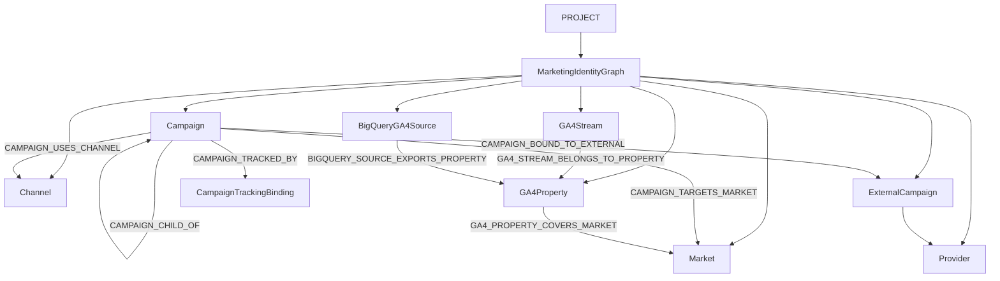

# Marketing Identity Graph architecture

**Mission:** IG-00 architecture freeze  
**Domain:** `app/identity_graph/`

```text
FOUNDATION
├── Business IQ
├── Data Foundation
└── Identity Graph
    ├── Markets
    ├── Channels
    ├── Campaigns
    ├── Audiences
    ├── Personas
    ├── Providers / Platforms
    └── Source identities
```

The PreM3 Identity Graph models marketing execution identities and business marketing entities. It does not model or persist individual consumer/person identity.

| Term | Meaning |
|---|---|
| **Persona** | Strategic/durable business archetype |
| **Audience** | Operational/targetable segment definition |
| **Campaign** | Governed marketing initiative/execution identity |

`PERSONA` and `AUDIENCE` node types (and related edges) are reserved. IG-00 does not persist, CRUD, activate, or discover them. A later IG-02A may own Audience/Persona ledgers.

This graph is a Project-scoped Foundation capability. MTA, Planning, experiments, and Decision Intelligence consume its IDs. They do not mint parallel campaign, market, or channel identities.



## Nodes (frozen)

Implemented: `MARKET` · `CHANNEL` · `CAMPAIGN` · `PROVIDER` · `EXTERNAL_CAMPAIGN` · `GA4_PROPERTY` · `GA4_STREAM` · `BIGQUERY_GA4_SOURCE`

Reserved (no persistence/CRUD in IG-00): `PERSONA` · `AUDIENCE`

Later `INITIATIVE` / `CREATIVE` / `EXPERIMENT` / `BRAND_STUDY` may extend the enum.

## Edges (closed set)

No free-text edge types. Implemented types are listed in the diagram.

Reserved for later ledgers: `AUDIENCE_REPRESENTS_PERSONA` · `CAMPAIGN_TARGETS_AUDIENCE` · `CAMPAIGN_TARGETS_PERSONA` · `AUDIENCE_AVAILABLE_IN_MARKET` · `AUDIENCE_BOUND_TO_EXTERNAL`

## Campaign Ledger V1 (IG-02 guidance)

`CanonicalCampaign` is identity metadata, not a performance or budget ledger. Optional `persona_ids[]` / `audience_ids[]` are strategic/execution scope refs. They do not contain audience members.

Recommended IG-02 fields:

| Field | IG-02 |
|---|---|
| `campaign_id` | server-generated immutable |
| `name` | required |
| `parent_campaign_id` | optional |
| `status` | required |
| `market_ids[]` | required (canonical market IDs after IG-01) |
| `channel_ids[]` | required |
| `planned_start_date` / `start_date` | strongly recommended |
| `planned_end_date` / `end_date` | strongly recommended |
| `objective_ref` / `objective` | optional |
| `owner_ref` / `owner_label` | optional |
| `persona_ids[]` | optional |
| `audience_ids[]` | optional |
| `description` | optional |

Keep budget, spend, impressions, conversions, attribution, ROAS, and person-level identity out of `CanonicalCampaign`.

## Reuse

| Concern | Canonical owner | Identity Graph rule |
|---|---|---|
| Channel | Channel Registry `channel_id` | Fail-closed; display names never join |
| Market | Business IQ `Market.market_id` | Reference only; see `BUSINESS_IQ_MARKET_IDENTITY_REQUEST` |
| Provider | `app/registry` `provider_id` | Exact registry match; mapping ≠ executable trust |
| Project | Control-plane workspace | `project_id` aliases `workspace_id` |

## Persistence

Reserved Firestore path:

`tenants/{tenant_id}/workspaces/{workspace_id}/identity_graph/...`

IG-00 uses in-memory contract behavior. Real persistence is IG-02. No event-scale GA4 rows, budget values, or person identifiers.

## Architecture decisions

### IG-ADR-001 — Identity Graph is a Project-scoped Foundation capability

Every graph is owned by `(tenant_id, project_id)`. Callers cannot supply tenant/project authority.

### IG-ADR-002 — the graph models marketing entities, not people

Product UI may say “Identity Graph.” Backend scope is marketing execution objects only.

### IG-ADR-003 — canonical Channel Registry is reused

Do not create a second channel taxonomy. Unknown `channel_id` fails closed.

### IG-ADR-004 — canonical market identity is reused / additively strengthened

Campaign `market_ids` reference BIQ `Market.market_id`. BIQ still does not mint server-owned market IDs; IG-00 records `BUSINESS_IQ_MARKET_IDENTITY_REQUEST` rather than forking a market namespace.

### IG-ADR-005 — PreM3 campaign ID is immutable cross-system identity

`cmp_<opaque>` is server-generated, never reused, never derived from name/provider/market/channel.

### IG-ADR-006 — `utm_id` is the preferred customer tracking implementation

Default binding: `utm_id=<campaign_id>`. Generate / copy / validate / map. Do not auto-write Google Ads/Meta/DV360.

### IG-ADR-007 — platform campaign IDs are preserved, not replaced

`CampaignExternalBinding` keeps provider/account/external campaign ID as provenance.

### IG-ADR-008 — campaign names are never durable identity

`name`, `campaign_name_raw`, `external_campaign_name`, and `utm_campaign` are display/source context.

### IG-ADR-009 — multi-property GA4 is represented as source topology

A unified analytical view is a governed topology, not one raw dataset.

### IG-ADR-010 — market assignment is governed and provenance-bearing

`MarketResolutionEvidence.method` is required provenance. `geo.country` is not an implicit default.

### IG-ADR-011 — master/regional overlap is never silently unioned

`MASTER_PLUS_REGIONAL` requires an explicit overlap policy. Cross-location is not `direct_union_ready`.

### IG-ADR-012 — MTA consumes Identity Graph; it does not own it

IG-00 does not change `MTA_INPUT_READY`, `MTARun`, snapshots, DP6, or Cloud workers. M5-03 consumes `MTAIdentityTouchpointRefs`.
