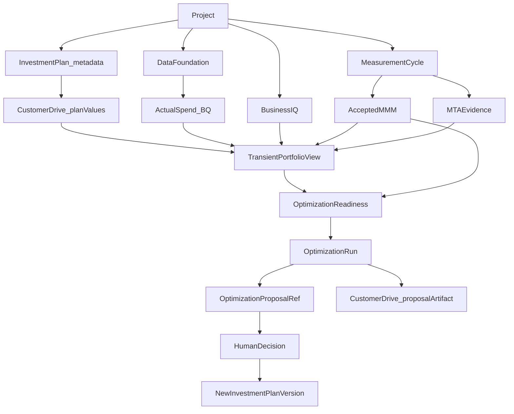

# Planning & Marketing Investment Portfolio architecture

Product authority for this workstream:

- [PREM3_INVESTMENT_PLAN_BUDGET_INGESTION_FEATURE_SPEC.md](../context/PREM3_INVESTMENT_PLAN_BUDGET_INGESTION_FEATURE_SPEC.md)
- [PREM3_MARKETING_PORTFOLIO_ASSET_ALLOCATION_AND_OPTIMIZATION_SPEC.md](../context/PREM3_MARKETING_PORTFOLIO_ASSET_ALLOCATION_AND_OPTIMIZATION_SPEC.md)
- [PREM3_PLANNING_OPTIMIZATION_BACKEND_MISSION_PLAN.md](../context/PREM3_PLANNING_OPTIMIZATION_BACKEND_MISSION_PLAN.md)

Implementation baseline, Project vs Workspace aliasing, and shared-contract reconciliation live in [P6_SOURCE_AUTHORITY.md](P6_SOURCE_AUTHORITY.md). Decisions: [P6_00_ARCHITECTURE_DECISIONS.md](P6_00_ARCHITECTURE_DECISIONS.md).

## Bounded contexts

- `app/investment_planning/` owns plan metadata, portfolio read contracts, privacy, and the metadata-only store barrier.
- `app/investment_optimization/` owns proposal refs, solver kinds, the unimplemented Meridian adapter seam, portfolio-to-model mapping, Model Consumption Contract compilation, and optimization readiness receipts.
- Business IQ, Data Foundation, and `app/modeling/mmm/` are not Planning owners.

## Canonical grain

`Project × fiscal year × quarter × market_id × channel_id`

`channel_id` is the Channel Registry ID. `market_id` is the Identity Graph `CanonicalMarket` ID. Market display strings are non-authoritative. Planning does not own market identity and does not resolve markets by name, fuzzy match, or ISO code. Unresolved `market_id` fails closed and blocks `INVESTMENT_PLAN_READY`. `campaign_id` is not part of this grain. Campaign Ledger is not a prerequisite for `INVESTMENT_PLAN_READY`.

Canonical Market source commit: `53b606a3b3bc529254816b8376d57c181b44a7ec` (path-checkout; see [P6_SOURCE_AUTHORITY.md](P6_SOURCE_AUTHORITY.md)).

## Optional Investment Plan

The Investment Plan is Project-scoped and optional. Missing `INVESTMENT_PLAN_READY` does not block Business IQ, Data Foundation, MMM, MTA, or `MODEL_READY`.

## Actuals and observations (P6-03)

Governed actual spend is assembled through `ActualSpendQuery`. See [PORTFOLIO_ACTUALS_INTEGRATION.md](PORTFOLIO_ACTUALS_INTEGRATION.md), [PORTFOLIO_STATE_MODEL.md](PORTFOLIO_STATE_MODEL.md), [PORTFOLIO_EVIDENCE_COVERAGE.md](PORTFOLIO_EVIDENCE_COVERAGE.md), and [PORTFOLIO_OBSERVATIONS.md](PORTFOLIO_OBSERVATIONS.md).

`canonical_media` is not portfolio actual-spend authority.

## Optimization readiness (P6-04)

Governed mapping from portfolio cells to accepted MMM variables, plus a fingerprinted `OptimizationReadinessReceipt`. See [PORTFOLIO_TO_MODEL_MAPPING.md](PORTFOLIO_TO_MODEL_MAPPING.md), [OPTIMIZATION_READINESS.md](OPTIMIZATION_READINESS.md), [OPTIMIZATION_INPUT_CONTRACT.md](OPTIMIZATION_INPUT_CONTRACT.md), and [PLANNING_CAUSAL_EVIDENCE_AUTHORITY.md](PLANNING_CAUSAL_EVIDENCE_AUTHORITY.md).

`OPTIMIZATION_READY` is readiness, not optimizer execution. Production BigQuery actuals remain `P6_03_PRODUCTION_ACTUALS_QUERY_PENDING`.

## Native fixed-budget optimization (P6-05)

A non-stale `OPTIMIZATION_READY` receipt may dispatch `OptimizationRun` (`orun_`). Native Meridian `BudgetOptimizer` (fixed budget) writes an immutable GCS result labeled `MODEL_RECOMMENDED`. See [NATIVE_MERIDIAN_FIXED_BUDGET_OPTIMIZATION.md](NATIVE_MERIDIAN_FIXED_BUDGET_OPTIMIZATION.md), [OPTIMIZATION_RUN_LIFECYCLE.md](OPTIMIZATION_RUN_LIFECYCLE.md), [OPTIMIZATION_RESULT_CONTRACT.md](OPTIMIZATION_RESULT_CONTRACT.md), and [OPTIMIZATION_EXECUTION_AUTHORITY.md](OPTIMIZATION_EXECUTION_AUTHORITY.md).

Drive plans are not mutated. Proposal approval is P6-06.
