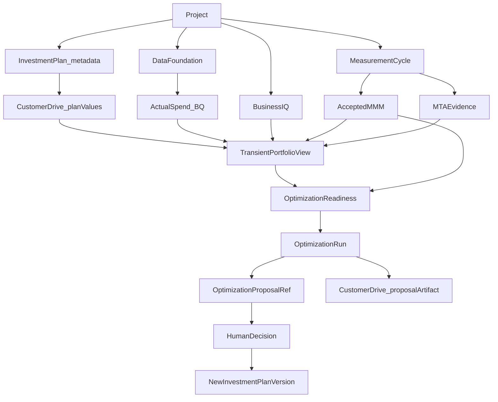

# Planning & Marketing Investment Portfolio architecture

Product authority for this workstream:

- [PREM3_INVESTMENT_PLAN_BUDGET_INGESTION_FEATURE_SPEC.md](../context/PREM3_INVESTMENT_PLAN_BUDGET_INGESTION_FEATURE_SPEC.md)
- [PREM3_MARKETING_PORTFOLIO_ASSET_ALLOCATION_AND_OPTIMIZATION_SPEC.md](../context/PREM3_MARKETING_PORTFOLIO_ASSET_ALLOCATION_AND_OPTIMIZATION_SPEC.md)
- [PREM3_PLANNING_OPTIMIZATION_BACKEND_MISSION_PLAN.md](../context/PREM3_PLANNING_OPTIMIZATION_BACKEND_MISSION_PLAN.md)

Implementation baseline, Project vs Workspace aliasing, and shared-contract reconciliation live in [P6_SOURCE_AUTHORITY.md](P6_SOURCE_AUTHORITY.md). Decisions: [P6_00_ARCHITECTURE_DECISIONS.md](P6_00_ARCHITECTURE_DECISIONS.md).

## Bounded contexts

- `app/investment_planning/` owns plan metadata, portfolio read contracts, privacy, and the metadata-only store barrier.
- `app/investment_optimization/` owns proposal refs, solver kinds, and the unimplemented Meridian adapter seam.
- Business IQ, Data Foundation, and `app/modeling/mmm/` are not Planning owners.

## Canonical grain

`Project × fiscal year × quarter × market_id × channel_id`

`channel_id` is the Channel Registry ID. `market_id` is the required Planning join key; it is not derived from BIQ display names. Durable market identity is a Foundation / Marketing Identity Graph dependency (IG-00 / IG-01). Unresolved market identity fails closed.

## Optional Investment Plan

The Investment Plan is Project-scoped and optional. Missing `INVESTMENT_PLAN_READY` does not block Business IQ, Data Foundation, MMM, MTA, or `MODEL_READY`.
