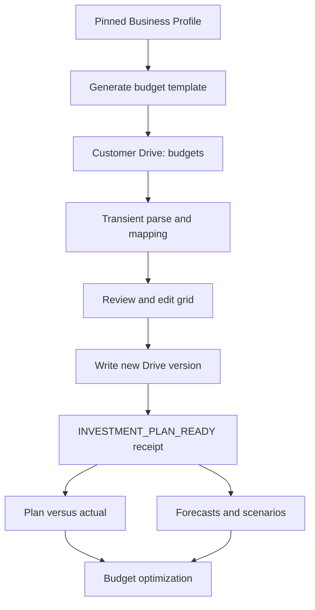

# PreM3 Investment Plan — Budget Ingestion and Google Drive Feature Specification

**Status:** Proposed canonical product and engineering specification  
**Date:** 2026-08-25  
**Product area:** Planning & Optimization / Marketing Investment Portfolio  
**Primary capability:** Investment Plan  
**Architecture baseline:** `datateamsix/prem3` `main` at `0d72636c2b7298a29e212ac3b382a52e11933425`  
**Business IQ schema baseline:** `business-iq/profile/v1`  
**Recommended delivery:** Near-term SaaS capability; model-independent MVP

---

## 1. Executive summary

PreM3 should add a lightweight **Investment Plan** capability that captures a customer's annual marketing budget as quarterly planned spend by market and channel. The default experience should use the markets and material channels already established in the versioned Business IQ profile.

Budget upload and Investment Plan creation are **optional enhancements, not platform prerequisites**. A user may complete Business IQ, establish the Data Foundation, run MMM/MTA measurement, review insights, and use eligible forecasting or scenario capabilities without uploading a budget. Supplying a governed budget materially improves decision relevance, plan-versus-actual analysis, constraint awareness, optimization quality, and outcome learning, but its absence must not block the core measurement journey.

The Pareto product is intentionally narrow:

> **Plan context + Market + Channel + Q1–Q4 planned spend**

This small contract is sufficient to provide:

- annual and quarterly portfolio visibility;
- allocation by market and channel;
- planned, committed, flexible, and remaining capital views;
- plan-versus-actual comparisons once spend sources are connected;
- a governed baseline for forecasting, scenarios, MMM/MTA evidence, and optimization;
- versioned investment decisions and later MEL outcome evaluation.

Google Drive is the customer-owned source of truth for budget files. PreM3 creates a `budgets` subfolder under the existing bound `prem3-modeling` root, writes a Business-IQ-aware template there, reads explicitly authorized budget files, and writes edited plan versions back to that folder.

PreM3 does **not** persist budget workbook bytes or allocation amounts in its own GCS or Firestore storage. The PreM3 control plane persists only the minimum metadata needed to bind, validate, version, reproduce, and govern the customer-owned Drive file.

Campaign-level budgets are not required in the MVP. When present in an existing spreadsheet, campaigns are treated as optional child execution detail and rolled up deterministically to the canonical market × channel × quarter portfolio grain.

---

## 2. Product positioning

The capability operationalizes PreM3's Marketing Investment Intelligence position:

- marketing dollars are capital;
- markets and channels are portfolio exposures;
- the Investment Plan is the approved baseline portfolio;
- actual spend shows execution against the portfolio;
- MMM, MTA, experiments, and brand evidence estimate contribution;
- forecasting and Monte Carlo characterize possible outcomes and uncertainty;
- optimization proposes portfolio rebalancing;
- Decisions and MEL measure what was approved, executed, and learned.

The Investment Plan is useful before a model exists. It therefore belongs under **Planning & Optimization**, upstream of Forecasting, Scenario Simulation, and Budget Optimization.

Recommended navigation:

1. Investment Plan
2. Forecasting
3. Scenario Simulation
4. Budget Optimization

Budget Optimization may remain blocked until an accepted model exists. Investment Plan must not be blocked by `MODEL_READY`.

---

## 3. Product goals

### 3.1 Primary goals

1. Let a marketing leader establish an annual/quarterly investment portfolio in minutes.
2. Reuse Business IQ rather than re-asking markets and channels.
3. Meet teams where budget planning already occurs: spreadsheets and Google Drive.
4. Keep customer budget files and allocation values in the customer's Google Drive.
5. Provide an editable, validated in-product grid without introducing a second canonical copy.
6. Create a reproducible baseline for actuals, measurement, scenarios, and optimization.
7. Preserve human approval and version history for consequential budget changes.

### 3.2 Non-goals for MVP

- Full enterprise FP&A
- Purchase orders, invoices, accruals, or accounts payable
- Vendor contracts and insertion-order management
- General-ledger reconciliation
- Media buying or campaign activation
- Campaign-level optimization
- Monthly or weekly budget entry
- Multi-currency allocation within one plan
- Native Google Sheets creation/editing through the Sheets API
- Storing budget allocation values in PreM3 Firestore, GCS, logs, analytics, or MEL payloads
- Requiring revenue, conversions, ROAS, ROMI, forecasts, or model outputs in the budget workbook
- Making budget upload, Drive connection, or `INVESTMENT_PLAN_READY` a prerequisite for Business IQ, Data Foundation, MMM/MTA, or general platform access

---

## 4. Core product decisions

### D1 — Canonical planning grain

The MVP canonical grain is:

```text
Investment Plan × Fiscal Year × Quarter × Market × Channel
```

Internally, each spreadsheet row is normalized into four quarterly allocation records.

### D2 — Business IQ supplies semantics

The generated template inherits:

- Business Profile snapshot ID and fingerprint;
- fiscal/business identity where available;
- confirmed markets;
- material marketing channels;
- channel market scopes;
- channel lifecycle and effective dates;
- measurement objectives;
- KPI meaning for downstream display, not workbook entry.

An imported unknown market or channel never silently mutates Business IQ. The user must map it to an existing concept or explicitly approve a Business Profile update proposal.

### D3 — Drive is the file and value system of record

The customer-owned Drive file is canonical for budget allocation values. PreM3 stores only references and governance metadata.

### D4 — Edits create Drive versions

Editing in PreM3 does not create a hidden server-side plan. Saving creates a new versioned workbook in Drive and advances the plan pointer after deterministic verification.

### D5 — Campaigns are subordinate, optional detail

Campaigns do not define the MVP portfolio grain. Existing campaign-detail budgets may be imported and rolled up, but optimization and portfolio reporting operate at market × channel × quarter.

### D6 — Separate readiness state

Do not broaden `BUSINESS_CONTEXT_READY`, `DATA_FOUNDATION_READY`, or `MODEL_READY`. Introduce a distinct deterministic receipt:

```text
INVESTMENT_PLAN_READY
```

This is a capability-specific receipt, not a global product gate. It is required only for functionality that needs a governed approved plan, such as plan-versus-actual reporting, portfolio adherence, plan-constrained optimization, or decision/outcome comparison against an approved baseline.

### D7 — Optional progressive enhancement

PreM3 must support three levels of planning context:

| Level | Available context | Supported outcome |
|---|---|---|
| No budget supplied | Business IQ + governed measurement evidence | Measurement, insights, historical-spend baselines, and eligible ad hoc scenarios continue |
| Lightweight scenario amount | User supplies a transient total or scenario constraint | One-off forecasting/simulation without creating an approved Investment Plan |
| Approved Investment Plan | Drive-governed market/channel/quarter budget | Plan-versus-actual, constraint-aware optimization, rebalancing, decision receipts, and predicted-versus-actual learning |

The product should encourage the richer level by explaining its benefit, not by forcing it into onboarding or readiness.

---

## 5. User experience

### 5.1 Entry state

The Investment Plan page displays one of four entry actions:

1. **Connect Google Drive** — if no active Drive binding exists.
2. **Create budget template** — generate a project-aware workbook in Drive.
3. **Choose budget file** — select an existing authorized Drive file.
4. **Enter amounts directly** — start with the generated grid and save it to Drive as the first plan version.

The empty state must label the capability as optional and include **Not now** or **Continue without a budget**. Dismissing the invitation must not create a warning, incomplete-foundation state, or blocked navigation item. The sidebar may display `Not set` rather than `Required`.

The page should explain:

> Your budget file stays in your Google Drive. PreM3 reads the authorized file, validates it, and writes approved edits back as versioned files in your PreM3 budgets folder.

### 5.2 Plan setup

Collect these values once in the UI:

| Field | Required | Source/default | Example |
|---|---:|---|---|
| Plan name | Yes | Suggested | FY2027 Marketing Plan |
| Fiscal year | Yes | User / Business IQ | 2027 |
| Currency | Yes | User / organization default | USD |
| Budget scope | Yes | User | Paid media only |
| Declared annual budget | No | User | 4,000,000 |
| Fiscal year start month | Yes | Default January | January |
| Notes | No | User | Excludes agency and production fees |

Budget-scope choices:

- `PAID_MEDIA_ONLY`
- `PAID_MEDIA_PLUS_CREATIVE`
- `FULLY_LOADED_MARKETING_INVESTMENT`
- `CUSTOM`

Custom scope requires a short definition.

### 5.3 Template generation

PreM3 creates a template using the pinned Business Profile snapshot.

Rows are generated from valid market/channel combinations:

- if a channel declares markets, use those combinations;
- otherwise combine the material channel with each active project market;
- omit channels that are retired before the plan year;
- include future/paused channels only when their lifecycle overlaps the plan year, with a review note;
- for a single-market project, keep the market field in the file but simplify it visually in the app.

The template is written to the bound Drive folder and opened from PreM3.

### 5.4 Existing-file selection

The user can select an existing CSV or XLSX file. PreM3 proposes column mappings and shows a preview before importing anything into the plan workflow.

Suggested mapping examples:

| Source header | Canonical field |
|---|---|
| Region | Market |
| Media Type | Channel |
| Q1 Budget | Q1 |
| First Quarter | Q1 |
| Campaign | Initiative |
| Locked/Flexible | Budget Status |

Only ambiguous semantic mappings require confirmation.

### 5.5 Review and edit

The normalized preview shows:

- quarterly and annual totals;
- allocation percentage by market and channel;
- declared-versus-calculated annual budget;
- unknown or ambiguous markets/channels;
- duplicate rows;
- blank versus intentional-zero cells;
- retired or not-yet-active channel conflicts;
- committed versus flexible amounts when present;
- campaign/initiative roll-up summaries when present.

Users may edit amounts directly in the grid. The active browser/API request may hold normalized values transiently in memory, but PreM3 does not persist them outside Drive.

### 5.6 Save and approve

Actions:

- **Save draft to Drive** — writes a new draft workbook version.
- **Validate plan** — executes deterministic validation against the pinned Business Profile.
- **Approve plan** — pins the validated Drive file identity and emits `INVESTMENT_PLAN_READY`.
- **Create revision** — creates a new draft linked to the approved predecessor.

An approved file is never silently overwritten.

---

## 6. Google Drive architecture

### 6.1 Canonical layout

Extend the existing bound depot without creating a second root:

```text
prem3-modeling/
  imports/
  exports/
  reports/
  budgets/
    templates/
      prem3_budget_template_v1.xlsx
    plans/
      FY2027_marketing_budget_v001.xlsx
      FY2027_marketing_budget_v002.xlsx
```

Names are visible conventions. Stored Drive folder IDs and file IDs are authority.

### 6.2 Binding changes

The current `DriveWorkspaceBinding` contains `root_folder_id`, `imports_folder_id`, `exports_folder_id`, and `reports_folder_id`.

Add backward-compatible optional fields:

```python
budgets_folder_id: str | None = None
budget_templates_folder_id: str | None = None
budget_plans_folder_id: str | None = None
```

Setup/repair must idempotently create and verify missing budget folders beneath the already-bound root. Existing bindings should be migrated lazily or by an explicit safe backfill. Do not make the new fields immediately required when old Firestore documents lack them.

If a bound folder is deleted or moved outside the root:

- mark the budget binding degraded;
- disable plan writes;
- preserve historical references and receipts;
- do not auto-bind a same-named replacement;
- require deliberate repair.

### 6.3 OAuth scope and file authorization

Continue using the repository's least-privilege scope:

```text
https://www.googleapis.com/auth/drive.file
```

This scope is per-file. It reliably covers files created by PreM3 and files explicitly opened/selected for the app. It does **not** guarantee that every arbitrary file a user manually drops into an app-created folder becomes app-authorized.

Therefore the MVP supports these safe paths:

1. PreM3 creates the template/file in the `budgets` folder.
2. The user uploads through the PreM3 UI and PreM3 writes the bytes directly to Drive.
3. The user drops an existing file into Drive, then selects it once through Google Picker or an equivalent explicit file authorization action.

Do not broaden to an all-Drive scope merely to create an automatic folder watcher in MVP.

### 6.4 No-copy data boundary

PreM3 may persist:

- plan ID and workspace ID;
- Business Profile snapshot ID/fingerprint;
- Drive binding and folder IDs;
- Drive file ID;
- file name, MIME type, version/revision identity, checksum, and modified time;
- schema/mapping version;
- fiscal year, currency, budget-scope enum, lifecycle status;
- validation checks, issue codes, timestamps, and approval identities;
- predecessor/successor plan references.

PreM3 must not persist:

- original workbook or CSV bytes;
- market/channel/quarter allocation amounts;
- campaign-level budget amounts;
- derived totals or allocation percentages in durable control-plane documents;
- workbook cell contents in logs, traces, analytics, errors, or MEL receipts.

The application reloads and parses the pinned Drive file on demand. Short-lived in-memory processing is allowed and must be discarded after the request/job.

### 6.5 Version identity and concurrency

Before any validation, approval, or save operation, re-read the file's provider identity:

- Drive file ID;
- `headRevisionId` when available;
- `md5Checksum` for blob files;
- Drive `version`;
- modified time/ETag when available.

If the file changed since it was loaded:

```text
SOURCE_CHANGED_SINCE_LOAD
```

The UI must reload or create an explicit revision; it must not overwrite the newer Drive content.

Saving from the PreM3 grid should create a new deterministic filename rather than overwrite the prior approved file:

```text
FY{year}_marketing_budget_v{NNN}.xlsx
```

The active plan pointer advances only after the new file is uploaded, re-read, checksummed, parsed, and validated.

---

## 7. Spreadsheet contract

### 7.1 Generated MVP template

Required columns:

| Column | Type | Semantics |
|---|---|---|
| `Market` | String | Business IQ market name or confirmed custom value |
| `Channel` | String | Business IQ canonical/custom channel name |
| `Q1` | Decimal | Planned spend in plan currency |
| `Q2` | Decimal | Planned spend in plan currency |
| `Q3` | Decimal | Planned spend in plan currency |
| `Q4` | Decimal | Planned spend in plan currency |

Optional supported columns:

| Column | Type | Semantics |
|---|---|---|
| `Budget Status` | Enum | `PLANNED`, `COMMITTED`, or `FLEXIBLE` |
| `Initiative` | String | Campaign, launch, sponsorship, or internal initiative label |
| `Initiative ID` | String | Stable customer/platform reference where available |
| `Notes` | String | Human context; never used as deterministic authority |

The default generated template should show `Budget Status` and `Notes` only if product design determines they do not reduce completion. `Initiative` columns should be accepted by the importer but omitted from the default Pareto template.

### 7.2 Example

```csv
Market,Channel,Q1,Q2,Q3,Q4,Budget Status,Notes
United States,Paid Search,250000,275000,300000,325000,FLEXIBLE,
United States,Paid Social,180000,200000,220000,240000,FLEXIBLE,
United States,Streaming Audio,0,75000,75000,50000,COMMITTED,Annual sponsorship
Canada,Paid Search,60000,65000,70000,75000,PLANNED,
```

### 7.3 Formatting rules

1. One header row.
2. One row per unique market × channel at the default grain.
3. Quarterly values must be numeric and nonnegative.
4. All values use the plan-level currency.
5. Blank means unknown/not entered.
6. `0` means intentionally no planned budget.
7. No merged cells in the data table.
8. No required formulas.
9. Subtotal and total rows are ignored only when confidently detected; otherwise they require review.
10. PreM3 calculates all totals and percentages.
11. Duplicate rows are never silently combined.
12. Mixed parent and child budget grains require explicit resolution.

### 7.4 Supported file types

MVP:

- `.xlsx`
- `.csv`

Deferred:

- Native Google Sheets read/write
- `.xls`
- PDF
- presentation files
- formula-dependent workbooks without cached values
- multiple currencies in one plan

Native Google Sheets support is separate from Meridian DatasetUpload materialization and must not reuse or weaken the existing `IMPORT_READY` contract. A budget workbook is a planning artifact, not a modeling dataset.

---

## 8. Campaign and initiative budgets

### 8.1 Product decision

Campaign budgets matter operationally, but they are not necessary for the first 80% of portfolio value.

Campaigns are often:

- short-lived and renamed frequently;
- platform-specific;
- configured with daily/lifetime limits that differ from approved budgets and actual spend;
- split across markets or objectives;
- too granular for standard MMM response curves;
- poor long-term portfolio identifiers.

The durable portfolio should therefore remain market × channel × quarter.

### 8.2 Use “initiative” as the cross-channel concept

Use `Initiative`, not only `Campaign`, because portfolio commitments may include:

- product launches;
- seasonal programs;
- sponsorships;
- brand campaigns;
- retail promotions;
- experiments;
- market entries;
- offline television or audio flights.

An initiative may have multiple child platform campaigns and may span channels, markets, and quarters.

### 8.3 MVP import behavior

If a file contains campaign/initiative rows:

1. Map each row to a confirmed market and channel.
2. Map dates/months to fiscal quarters when necessary.
3. Sum child amounts deterministically to market × channel × quarter.
4. Show the roll-up preview before acceptance.
5. Preserve initiative labels in the Drive workbook only.
6. Record non-value lineage metadata sufficient to explain that a parent line was compiled from child rows.

Do not persist child budget amounts in the PreM3 control plane.

### 8.4 Mixed-grain guardrail

A file that contains both channel totals and campaign details can double-count spend.

The importer must require one of:

- use parent channel rows as authoritative;
- use child initiative rows and calculate parents;
- provide an explicit `Row Type` mapping.

Never sum both levels silently.

### 8.5 When campaign detail becomes strategically relevant

Surface initiative detail when it represents:

- a material committed investment;
- a distinct funnel or brand objective;
- a product/market launch;
- a formal experiment or lift study;
- a hard flight/date constraint;
- a spend amount that cannot be reallocated;
- an execution unit needed after a channel-level optimization decision.

Future capability may allocate a recommended channel budget down to initiatives. That is an execution-planning layer and should follow, not precede, a trusted market/channel portfolio.

---

## 9. Domain contracts

Create a bounded domain such as:

```text
app/investment_planning/
```

Do not place budget-plan state inside Business IQ, Data Foundation, DatasetUpload, or the MMM run state.

### 9.1 `InvestmentPlan`

Metadata only; no allocation values:

```python
class InvestmentPlan(FrozenModel):
    plan_id: str
    tenant_id: str
    workspace_id: str
    name: str
    fiscal_year: int
    fiscal_start_month: int
    currency: str
    budget_scope: BudgetScope
    budget_scope_custom_text: str | None
    business_profile_snapshot_id: str
    business_profile_fingerprint: str
    active_source_version_id: str | None
    status: InvestmentPlanStatus
    revision: int
    predecessor_plan_id: str | None
    created_at: datetime
    updated_at: datetime
    created_by: str
    approved_at: datetime | None
    approved_by: str | None
```

`declared_annual_budget` should remain in Drive if the no-value persistence boundary is absolute. If product later decides that a single declared total may be stored, that must be a separate explicit privacy decision—not an accidental implementation detail.

### 9.2 `BudgetDriveSourceVersion`

```python
class BudgetDriveSourceVersion(FrozenModel):
    source_version_id: str
    plan_id: str
    tenant_id: str
    workspace_id: str
    drive_connection_id: str
    budgets_folder_id: str
    drive_file_id: str
    file_name: str
    mime_type: str
    drive_version: str | None
    head_revision_id: str | None
    md5_checksum: str | None
    modified_time: datetime | None
    schema_version: str
    mapping_version: str
    source_grain: BudgetSourceGrain
    predecessor_source_version_id: str | None
    created_at: datetime
    created_by: str
```

### 9.3 `BudgetColumnMapping`

```python
class BudgetColumnMapping(FrozenModel):
    mapping_version: str
    market_column: str
    channel_column: str
    quarter_columns: dict[str, str]
    budget_status_column: str | None
    initiative_column: str | None
    initiative_id_column: str | None
    notes_column: str | None
    source_grain: BudgetSourceGrain
    confirmed_by: str
    confirmed_at: datetime
```

Mappings store header identities only, not cell values.

### 9.4 `InvestmentPlanValidationReceipt`

```python
class InvestmentPlanValidationReceipt(FrozenModel):
    receipt_id: str
    plan_id: str
    source_version_id: str
    business_profile_snapshot_id: str
    business_profile_fingerprint: str
    source_fingerprint: str
    status: InvestmentPlanReadyStatus
    checks: tuple[BudgetValidationCheck, ...]
    issue_codes: tuple[str, ...]
    executed_at: datetime
    executed_by: str
```

Checks contain pass/fail state and row references where safe. They must not embed budget amounts.

### 9.5 Status enums

```text
InvestmentPlanStatus:
  DRAFT
  VALIDATED
  APPROVED
  SUPERSEDED
  SOURCE_STALE
  SOURCE_UNAVAILABLE

InvestmentPlanReadyStatus:
  NOT_READY
  INVESTMENT_PLAN_READY

BudgetSourceGrain:
  MARKET_CHANNEL_QUARTER
  INITIATIVE_QUARTER
  MIXED_REVIEW_REQUIRED
```

---

## 10. Deterministic validation

Only deterministic code may emit `INVESTMENT_PLAN_READY`.

Required checks:

| Code | Requirement |
|---|---|
| `DRIVE_BINDING_ACTIVE` | Bound Drive depot is active |
| `BUDGET_FOLDER_BOUND` | File is under authorized budgets folder or explicitly Picker-authorized and copied there |
| `SOURCE_EXISTS` | Drive file exists and is not trashed |
| `SOURCE_VERSION_IDENTIFIED` | Stable provider version/checksum is available |
| `FORMAT_SUPPORTED` | CSV/XLSX parser is supported |
| `SCHEMA_MAPPED` | Required columns are mapped |
| `BUSINESS_PROFILE_PINNED` | Profile snapshot and fingerprint are recorded |
| `MARKETS_RESOLVED` | All market values map or are explicitly resolved |
| `CHANNELS_RESOLVED` | All channel values map or are explicitly resolved |
| `QUARTERS_VALID` | Q1–Q4 fields are present and numeric/blank |
| `AMOUNTS_NONNEGATIVE` | No negative planned amounts |
| `BLANKS_ACKNOWLEDGED` | Blank cells are resolved or acknowledged |
| `DUPLICATES_RESOLVED` | Duplicate canonical keys are resolved |
| `MIXED_GRAIN_RESOLVED` | Parent/child double-counting risk is resolved |
| `CURRENCY_SINGLE` | One plan currency is enforced |
| `DECLARED_TOTAL_RECONCILED` | If provided, declared total matches calculated total or difference is acknowledged |
| `SOURCE_UNCHANGED` | Drive identity matches the version validated |

Warnings that need not block readiness:

- high concentration in one channel;
- material Business IQ channel has no allocation;
- channel lifecycle only overlaps part of the year;
- all budget is marked committed;
- no declared annual total;
- campaign/initiative detail omitted.

Gemini may explain checks and suggest resolutions. Gemini may not declare readiness, alter amounts, merge duplicate rows, or change market/channel mappings without explicit confirmation.

---

## 11. API surface

Suggested workspace-scoped endpoints:

```text
GET    /v1/workspaces/{workspace_id}/investment-plans
POST   /v1/workspaces/{workspace_id}/investment-plans
GET    /v1/workspaces/{workspace_id}/investment-plans/{plan_id}

POST   /v1/workspaces/{workspace_id}/investment-plans/{plan_id}/template
POST   /v1/workspaces/{workspace_id}/investment-plans/{plan_id}/sources/drive
POST   /v1/workspaces/{workspace_id}/investment-plans/{plan_id}/mapping

GET    /v1/workspaces/{workspace_id}/investment-plans/{plan_id}/view
POST   /v1/workspaces/{workspace_id}/investment-plans/{plan_id}/validate
POST   /v1/workspaces/{workspace_id}/investment-plans/{plan_id}/save-version
POST   /v1/workspaces/{workspace_id}/investment-plans/{plan_id}/approve
POST   /v1/workspaces/{workspace_id}/investment-plans/{plan_id}/revise
GET    /v1/workspaces/{workspace_id}/investment-plans/{plan_id}/ready
```

Authority rules:

- Tenant identity comes only from verified request context.
- Workspace authorization uses the existing control-plane boundary.
- Root and budget folder IDs come from server-owned binding state.
- A user may select a Drive file ID through an authorized UI action; the server revalidates its authorization and folder relationship.
- No model/tool call accepts tenant, workspace, folder, file, plan, or approval authority.
- API responses use explicit typed models; do not repeat the current Business IQ `dict[str, Any]` OpenAPI weakness.

`GET .../view` may return transient normalized allocation rows to the authenticated frontend. Those rows are not written to PreM3 persistence or logs.

---

## 12. Technical implementation guidance

### 12.1 Backend components

Add:

```text
app/investment_planning/
  contracts.py
  enums.py
  ids.py
  fingerprint.py
  parser.py
  mapping.py
  validator.py
  template.py
  drive.py
  service.py
  store.py
  firestore.py
```

The Firestore store persists plan/source/receipt metadata only.

### 12.2 Drive adapter changes

Current `DriveClient` already supports folder creation, child listing, download, upload, and child lookup.

MVP can use versioned new-file writes and does not require overwriting an existing file. Add only what is necessary for:

- explicit file authorization/Picker handoff metadata;
- modified-time/ETag or equivalent provider identity if not currently returned;
- optional Google-native file export later.

Current `upload_file` correctly fails if a same-named file exists. Template generation should be idempotent by locating the existing schema-versioned template or creating a new explicitly versioned name.

### 12.3 Parser

Parser properties:

- deterministic;
- maximum file size and row bounds;
- no macros;
- no external workbook links;
- formula cells accepted only when a safe cached numeric value exists;
- sheet selection explicit when multiple plausible sheets exist;
- locale-aware number parsing only after locale is known;
- workbook content never logged;
- temporary files isolated and deleted immediately after parsing.

Recommended MVP libraries:

- Python `csv` for CSV;
- `openpyxl` in read-only/data-only mode for XLSX;
- `Decimal` for currency amounts.

Do not use binary floating point for persisted or calculated currency values.

### 12.4 Template generation

The template compiler consumes a pinned `BusinessProfileSnapshot` and produces deterministic XLSX bytes in memory. It should include:

- exact required headers;
- pre-populated market/channel rows;
- human-readable instructions;
- plan metadata display;
- optional dropdown validation for Business IQ values;
- no hidden formulas required for correctness;
- a schema/version marker in workbook metadata or a dedicated non-sensitive cell.

The bytes are uploaded directly to Drive and discarded.

### 12.5 Frontend

The Investment Plan UI requires:

- Drive connection state;
- template creation and Drive open action;
- Google Picker selection;
- mapping review;
- editable quarterly grid;
- validation/issues panel;
- allocation summaries calculated from transient response data;
- source revision/staleness warning;
- save-to-Drive and approve actions;
- version history using metadata only.

Do not put budget amounts in client analytics, error monitoring breadcrumbs, page URLs, localStorage, or marketing-event payloads.

### 12.6 Relationship to existing contracts

- Business IQ remains the semantic authority.
- Data Foundation remains the evidence/data plane.
- Budget files do not become `DatasetUpload` objects.
- Budget validation does not emit `IMPORT_READY`.
- Investment Plan readiness does not imply `DATA_FOUNDATION_READY`, `MODEL_READY`, or `PUBLISH_READY`.
- Missing Investment Plan readiness does not block `BUSINESS_CONTEXT_READY`, `DATA_FOUNDATION_READY`, MMM/MTA execution, `MODEL_READY`, insights, or general project use.
- A Measurement Cycle or future Planning Cycle pins an approved Investment Plan source version.
- Optimization outputs are proposals and never silently replace the approved plan.

When no approved plan exists, downstream capabilities must make their baseline explicit. Depending on the capability, PreM3 may use governed historical spend, a transient user-entered scenario amount, or no budget baseline. It must never imply that historical spend is an approved budget.

---

## 13. Privacy, security, and governance

1. Use least-privilege `drive.file` OAuth.
2. Encrypt refresh-token envelopes using the existing KMS architecture.
3. Folder IDs and file IDs are authority; names are display conventions.
4. Validate every selected file against tenant/workspace binding.
5. Never derive tenant identity from Google account identity.
6. Never log cell data or budget amounts.
7. Do not send budget amounts to product analytics.
8. Do not store budget bytes in GCS.
9. Do not store normalized allocation rows in Firestore.
10. Preserve only hashes, revisions, mappings, states, and receipts.
11. External source changes invalidate stale validation.
12. User approval is required before an Investment Plan becomes active.
13. Disconnecting Drive revokes current access but does not delete customer files.
14. A deleted source becomes `SOURCE_UNAVAILABLE`; it is not silently replaced.

---

## 14. Product metrics

Measure adoption without collecting budget values:

- Drive connected
- Budget folder provisioned
- Template created
- File selected
- Mapping completed
- Validation completed
- Number of issue categories, not offending values
- Plan approved
- Revision created
- Time from plan creation to readiness
- Percentage of plans using generated template versus existing file
- Percentage of files requiring campaign/mixed-grain resolution

Do not emit market names, channel custom text, file names, amounts, objectives, KPI values, notes, or campaign names into marketing/product analytics.

---

## 15. Acceptance criteria

The MVP is complete when:

1. An authorized workspace can provision `prem3-modeling/budgets/templates` and `budgets/plans` under the existing bound Drive root.
2. Existing Drive bindings are upgraded safely without breaking imports, exports, or reports.
3. PreM3 generates an XLSX template from a pinned Business IQ snapshot.
4. The template contains the correct market/channel rows and Q1–Q4 columns.
5. Template bytes are written directly to Drive and not persisted by PreM3.
6. A user can select an authorized CSV/XLSX file from Drive.
7. PreM3 can map noncanonical headers with user confirmation.
8. The user can review and edit quarterly amounts in the product.
9. Saving creates a new Drive-resident workbook version.
10. The control plane stores no allocation values or workbook bytes.
11. Unknown market/channel values cannot silently change Business IQ.
12. Blank and zero are not conflated.
13. Duplicate and mixed-grain rows cannot silently double-count.
14. Campaign/initiative rows roll up deterministically when explicitly selected as the source grain.
15. Approval pins Drive file identity and Business Profile identity.
16. Source changes invalidate stale validation.
17. Only deterministic code emits `INVESTMENT_PLAN_READY`.
18. Budget Optimization can read an approved plan as its baseline but cannot modify it silently.
19. Typed API schemas and tests cover every user-visible state.
20. Logs, traces, analytics, fixtures, and receipts contain no real budget values.
21. A user can dismiss or skip budget setup without blocking Business IQ, Data Foundation, measurement, insights, or unrelated workflows.
22. Plan-dependent features explain what additional capability budget data unlocks rather than presenting upload as mandatory onboarding.

---

## 16. Test strategy

### Unit tests

- Template generation from single/multiple markets
- Channel effective-date filtering
- CSV/XLSX parsing
- Header mapping
- Blank versus zero
- Decimal/currency parsing
- Duplicate detection
- Negative amount rejection
- Total reconciliation
- Campaign/initiative roll-up
- Mixed-grain rejection
- Business IQ market/channel mapping
- Source fingerprint stability
- Readiness ownership
- Metadata-only serialization

### Integration tests

- New Drive binding creates budget subfolders
- Existing Drive binding adds missing budget subfolders idempotently
- Template upload and retrieval
- Picker-authorized file registration
- Outside-root or unauthorized file rejection
- External file modification produces stale-source state
- Grid edit creates a new Drive version
- Approval pins exact source and Business Profile versions
- Drive disconnect/deletion degrades without data loss or silent rebind
- Tenant/workspace isolation

### Privacy regression tests

- Firestore documents contain no allocation values
- GCS receives no budget artifact
- structured logs contain no workbook cells or amounts
- analytics events contain only approved non-sensitive state transitions
- error responses expose row numbers/codes without cell contents where possible

---

## 17. Delivery phases

### Phase 1 — Pareto MVP

- Drive budget folders
- Business-IQ-generated XLSX template
- Drive file selection
- CSV/XLSX parsing
- Market/channel/Q1–Q4 mapping
- Editable grid
- Save new Drive version
- Deterministic validation and approval
- Metadata-only control plane

### Phase 2 — Plan versus actual

- Map governed spend sources from Data Foundation
- Compare plan, committed, actual, forecast-at-completion, and remaining
- Pacing and variance alerts
- Preserve evidence authority and freshness

### Phase 3 — Measurement coverage and scenarios

- Attach accepted MMM/MTA/experiment evidence to portfolio lines
- Show measured/unmeasured allocation coverage
- Scenario creation from an approved plan
- Monte Carlo outcome distributions

### Phase 4 — Optimization and execution planning

- Risk-adjusted market/channel rebalancing
- Human approval and decision receipts
- Optional initiative/campaign allocation after channel decisions
- Predicted-versus-actual MEL learning

---

## 18. Architecture flow



---

## 19. Final recommendation

Build the Investment Plan as a small, model-independent, Drive-native planning layer.

The first release should avoid campaign-level complexity and avoid storing customer budget values. Its job is to optionally establish a trustworthy, editable, versioned market/channel/quarter portfolio that future measurement and optimization can act upon. Users who do not supply a budget remain fully eligible for the core Business IQ, Data Foundation, measurement, and insights journey.

The most important implementation principle is:

> **Business IQ defines the portfolio semantics. Google Drive owns the budget file and values. PreM3 validates, versions, explains, and connects the plan to measurement and decisions.**

Campaigns matter only when they carry material commitments, distinct objectives, experiments, or execution constraints. They should enter as optional initiative detail beneath the durable portfolio—not become the foundation of the portfolio itself.

---

## 20. Source references

Repository baseline reviewed:

- `app/business_iq/contracts.py`
- `app/business_iq/readiness.py`
- `app/business_iq/service.py`
- `app/service/business_iq_models.py`
- `app/control_plane/models.py`
- `app/service/google_drive.py`
- `app/integrations/google/adapters.py`
- `app/data_foundation/discovery/snapshot_adapter.py`
- `docs/context/17_IMPORT_AND_PUBLISH_GOVERNANCE.md`
- `docs/backend/M2_MISSION_2_ACCEPTANCE_FREEZE_REPORT.md`

External technical references:

- Google Drive API — Choose Google Drive API scopes: https://developers.google.com/workspace/drive/api/guides/api-specific-auth
- Google Drive API — Create and populate folders: https://developers.google.com/workspace/drive/api/guides/folder
- Google Drive API — Resolve `appNotAuthorizedToFile`: https://developers.google.com/workspace/drive/api/guides/handle-errors
