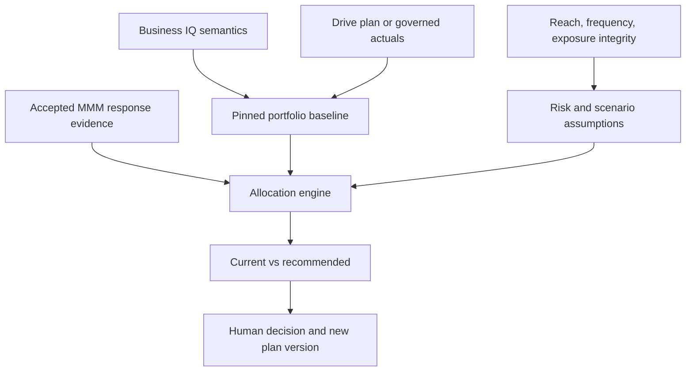

# PreM3 Marketing Portfolio Asset Allocation and Optimization Specification

**Status:** Proposed canonical mathematical, product, and engineering specification

**Date:** 2026-08-25

**Product area:** Planning & Optimization / Budget Optimization

**Depends on:** `PREM3_INVESTMENT_PLAN_BUDGET_INGESTION_FEATURE_SPEC.md`

**Modeling baseline:** Accepted Meridian MMM evidence, with optional MTA, experiment, brand, and exposure-integrity evidence

**Decision boundary:** Human-approved recommendations only

---

## 1. Executive summary

PreM3 should treat marketing investment as a governed portfolio-allocation problem:

- marketing dollars are capital;
- market × channel × quarter lines are portfolio exposures;
- an approved Investment Plan or governed actual-spend snapshot is the baseline portfolio;
- MMM response curves estimate nonlinear incremental outcome and diminishing returns;
- posterior draws and future assumptions express uncertainty;
- reach, frequency, and exposure integrity characterize whether purchased delivery becomes useful human exposure;
- constraints represent commitments, operating realities, and strategic intent;
- optimization proposes a risk-aware reallocation;
- approval creates a new plan version rather than overwriting the baseline;
- observed execution and outcomes become decision and MEL evidence.

The portfolio analogy is useful, but the engine must not transplant a generic mean-variance stock optimizer into marketing. Media returns are causal estimates, nonlinear, saturating, time-dependent, and not continuously tradable. PreM3 should use the accepted MMM's response functions and posterior uncertainty as the primary return engine.

Meridian's native fixed-budget optimization maximizes posterior-mean expected KPI or revenue for a specified total budget, while its flexible-budget scenarios use target ROI or marginal ROI constraints. PreM3 should use that native capability first, then add an explicitly labeled risk-aware scenario layer rather than implying that the native result already optimizes downside risk.

---

## 2. Product statement

> **PreM3 transforms the current marketing investment portfolio into governed, evidence-linked reallocation proposals that balance expected incremental value, exposure quality, uncertainty, and business constraints.**

The optimizer answers:

1. What is the current portfolio?
2. What evidence supports each allocation?
3. What delivery and exposure risks accompany it?
4. What allocations are feasible?
5. Which feasible allocation best serves the selected objective and risk posture?
6. How does the proposed portfolio differ from the baseline?
7. What assumptions, uncertainties, and constraints drive the recommendation?

---

## 3. Portfolio analogy and limits

| Investment concept | Marketing analogue |
|---|---|
| Capital | Marketing budget |
| Asset/exposure | Market × channel × quarter allocation |
| Portfolio weight | Allocation divided by selected total budget |
| Expected return | Expected incremental revenue, margin, KPI, or brand outcome |
| Marginal return | Derivative of the media response curve at the proposed spend |
| Risk | Posterior, scenario, exposure-delivery, data, and model uncertainty |
| Liquidity | Flexible versus committed/restricted capital |
| Concentration | Share of capital in a market, channel, platform, or funnel role |
| Rebalancing | Moving budget from the current allocation to a proposed allocation |
| Efficient frontier | Nondominated expected-outcome/downside-risk scenarios |
| Investment thesis | Business objective, causal assumptions, model evidence, and constraints |

Important differences from financial assets:

- response is nonlinear and commonly exhibits saturation and carryover;
- the same dollar can have different effects by time, geo, cost, and flighting;
- channel outcomes may be only partially identified;
- historical allocation influences available evidence;
- platform-reported attribution is not equivalent to causal return;
- cross-channel interactions are absent unless explicitly modeled;
- delivery quality can change the usable exposure created by the same nominal spend;
- reallocation itself has operational cost, timing, and learning effects.

---

## 4. Governing architecture



### 4.1 Authority by layer

| Layer | Authoritative inputs |
|---|---|
| Business IQ | Markets, channels, lifecycle, objectives, KPI definitions, economics, relationships, events, priors, unknowns |
| Investment Plan | Approved budget, period allocations, statuses, commitments |
| Data Foundation | Actual spend, media execution, outcomes, CPM/cost assumptions, reach/frequency, quality signals, freshness |
| Measurement | Posterior response functions, incremental contribution, mROI, uncertainty, model quality |
| Optimization | Objective, constraints, scenarios, solver, recommended allocation |
| Decisions/MEL | Approval, modification, execution, realized result, lesson |

Business IQ defines the portfolio schema; it does not invent spend. Data Foundation supplies observed execution; it does not define an approved budget. Measurement provides evidence; it does not possess decision authority.

---

## 5. Business IQ inputs

The optimizer consumes a pinned `BusinessProfileSnapshot` and uses existing contracts as follows:

| Business IQ contract | Optimization use |
|---|---|
| `BusinessIdentity.industry` | Suggest relevant objective/metric templates; never choose one silently |
| `MeasurementObjective` | Candidate objective and decision question |
| `kpi` and `kpi_definition` | Outcome semantics and compatible optimizer metric |
| `Market` | Canonical market axes and geo scope |
| `MarketingChannel` | Canonical channel axes, active dates, roles, market scope, materiality |
| `BusinessFact` | Currency, margin, LTV, revenue-per-KPI, commitments, capacity, targets, and risk facts when confirmed |
| `BusinessEvent` | Future scenario assumptions and availability constraints |
| `BusinessRelationship` | Channel/funnel/product relationships and causal interpretation |
| `BusinessHypothesis` | Assumptions requiring review, not automatic constraints |
| `PriorEvidenceReference` | Experiment/calibration evidence and earlier model references |
| `KnowledgeGap` | Missing assumptions that must remain explicit |

Industry suggestions may propose default metrics and guardrails, but every selected formula, unit value, contribution margin, and risk posture must be confirmed or derived from a governed source.

---

## 6. Mathematical notation

Let:

- \(i \in \mathcal{I}\) index portfolio lines, normally market × channel × quarter;
- \(m \in \mathcal{M}\) index model-supported paid media channels;
- \(g \in \mathcal{G}\) index modeled geographies;
- \(t \in \mathcal{T}\) index model time periods;
- \(x_i \ge 0\) be proposed spend on portfolio line \(i\);
- \(b_i\) be baseline spend;
- \(B\) be the selected total budget;
- \(S\) be the number of posterior/scenario draws;
- \(\theta^{(s)}\) be MMM parameters for draw \(s\);
- \(z_{g,t,m}(\mathbf{x})\) be media execution implied by spend and future assumptions;
- \(R^{(s)}(\mathbf{x})\) be incremental outcome under draw \(s\);
- \(V^{(s)}(\mathbf{x})\) be decision value under draw \(s\).

The planning grain may be more detailed than the model grain. A versioned mapping must translate portfolio lines into model-supported channel, geo, and time inputs. PreM3 may optimize only dimensions supported by the accepted evidence or explicitly preserve unsupported shares.

---

## 7. Spend-to-execution and response engine

### 7.1 Spend-to-media execution

Spend affects outcomes through media execution, not by amount alone. A simplified mapping is:

\[
z_{g,t,m}(\mathbf{x})
=
\sum_{i:m(i)=m}
p_{g,t\mid i}
\frac{x_i}{c_{g,t,m}}
\]

where:

- \(p_{g,t\mid i}\) is the future geo/time flighting share;
- \(c_{g,t,m}\) is expected cost per media unit;
- both are versioned scenario assumptions.

Meridian permits future post-modeling assumptions to differ from historical data, including cost per media unit, revenue per KPI, flighting patterns, time windows, and geographies. PreM3 must therefore pin these assumptions with every optimization.

### 7.2 Posterior incremental outcome

At an abstract level:

\[
R^{(s)}(\mathbf{x})
=
\sum_{g,t,m}
f_{g,t,m}\!\left(z_{g,t,m}(\mathbf{x});\theta^{(s)}\right)
\]

The function \(f\) represents the accepted model's carryover/adstock, saturation/shape, geo hierarchy, and channel effect. Optimization must evaluate the entire proposed schedule when carryover crosses quarters; it must not optimize each quarter independently and then add the results unless the model supports that decomposition.

### 7.3 ROI and marginal ROI

For a revenue-valued outcome:

\[
ROI(\mathbf{x})=
\frac{\mathbb{E}[R(\mathbf{x})]}{\sum_i x_i}
\]

For channel \(i\), marginal ROI is approximately:

\[
mROI_i(\mathbf{x})=
\frac{\partial\,\mathbb{E}[R(\mathbf{x})]}{\partial x_i}
\]

Historical ROI grades past average efficiency. Marginal ROI guides the next unit of allocation and reflects the local point on the response curve.

---

## 8. Objective functions

### 8.1 Fixed-budget incremental outcome

The MVP objective is:

\[
\max_{\mathbf{x}}
\quad
\frac{1}{S}\sum_{s=1}^{S}R^{(s)}(\mathbf{x})
\]

subject to:

\[
\sum_i x_i=B
\]

and the applicable constraints in Section 10.

This aligns with Meridian's fixed-budget scenario: maximize expected incremental KPI or revenue without changing the selected total budget.

### 8.2 Flexible budget

Flexible-budget optimization allows total spend to vary within approved bounds:

\[
B_{min}\le\sum_i x_i\le B_{max}
\]

with a target such as:

\[
ROI(\mathbf{x})\ge ROI_{target}
\]

or:

\[
mROI(\mathbf{x})\ge mROI_{floor}
\]

This is appropriate for questions such as “how much can we invest before marginal returns fall below our hurdle rate?”

### 8.3 Incremental contribution margin or net value

When Business IQ and Data Foundation provide a governed contribution-margin or unit-value assumption, define:

\[
V^{(s)}(\mathbf{x})
=
\gamma R^{(s)}(\mathbf{x})-\sum_i x_i
\]

where \(\gamma\) converts modeled incremental outcome into incremental contribution value. Then:

\[
ROMI(\mathbf{x})=
\frac{\mathbb{E}[V(\mathbf{x})]}{\sum_i x_i}
\]

The UI must disclose \(\gamma\), its source, time horizon, scope, and freshness. If no valid conversion exists, optimize the original KPI and report cost per incremental KPI rather than fabricating financial return.

### 8.4 Blended objectives

A business may choose a governed weighted objective:

\[
V^{(s)}(\mathbf{x})
=
\sum_{k=1}^{K}\omega_k\,\widetilde{R}^{(s)}_k(\mathbf{x})
\]

where metrics are normalized before weighting and \(\sum_k\omega_k=1\). Blended revenue/brand objectives are advanced capability because scales, horizons, and evidence authority differ. Every weight requires explicit confirmation and sensitivity analysis.

---

## 9. Risk and uncertainty

### 9.1 Risk taxonomy

PreM3 must distinguish:

| Risk | Meaning |
|---|---|
| Parameter/posterior risk | Uncertainty in estimated model parameters and incremental response |
| Scenario risk | Uncertainty in CPM, flighting, revenue per KPI, market conditions, or future execution |
| Exposure-delivery risk | Paid delivery fails to become human, viewable, in-target, appropriately frequent exposure |
| Model risk | Misspecification, causal-identification limits, omitted variables, unsupported interactions |
| Data risk | Missing, stale, inconsistent, or incorrectly mapped inputs |
| Concentration risk | Excessive dependence on a channel, market, platform, or objective |
| Execution risk | Operational inability to deploy the proposed amount or timing |
| Optimization risk | Solver/grid approximation, unstable optima, or sensitivity to small assumption changes |

Posterior intervals do not automatically include every risk above. The product must not label a posterior interval as “total business risk.”

### 9.2 Expected-value objective

The neutral posture maximizes posterior/scenario mean value:

\[
\max_{\mathbf{x}}\ \mathbb{E}[V(\mathbf{x})]
\]

This is simple and aligns with Meridian's native mean-based optimization, but it may choose allocations with unattractive downside tails.

### 9.3 Lower-tail and CVaR objective

Define shortfall from a decision threshold \(T\):

\[
L^{(s)}(\mathbf{x})=
\max\left(T-V^{(s)}(\mathbf{x}),0\right)
\]

For confidence level \(\alpha\), sample CVaR is:

\[
CVaR_{\alpha}(L)=
\min_{\eta}
\left[
\eta+
\frac{1}{(1-\alpha)S}
\sum_{s=1}^{S}
\max(L^{(s)}-\eta,0)
\right]
\]

A risk-adjusted objective is:

\[
\max_{\mathbf{x}}
\quad
\mathbb{E}[V(\mathbf{x})]
-\lambda\,CVaR_{\alpha}(L(\mathbf{x}))
\]

This penalizes harmful lower-tail scenarios rather than symmetric variance. It is a PreM3 extension, not a claim about Meridian's native optimizer.

### 9.4 Probability guardrails

Optional decision rules include:

\[
P\!\left(V(\mathbf{x})\ge 0\right)\ge p_{min}
\]

or a minimum probability of beating the baseline:

\[
P\!\left(V(\mathbf{x})>V(\mathbf{b})\right)\ge p_{improve}
\]

These may be evaluated as post-optimization acceptance checks before being implemented as solver constraints.

### 9.5 User-facing risk postures

Do not expose \(\lambda\) without context. Offer versioned presets:

| Posture | Initial behavior |
|---|---|
| Expected outcome | Maximize posterior mean; report downside separately |
| Balanced | Mean objective plus movement/concentration constraints and downside disclosure |
| Conservative | Stronger movement limits and lower-tail/CVaR guardrail after validation |

Preset parameters remain visible in the assumptions panel and can be inspected by an expert.

---

## 10. Constraint system

Constraints are first-class, versioned decision inputs.

### 10.1 Financial and allocation constraints

```math
\sum_i x_i = B
```

```math
L_i \le x_i \le U_i
```

```math
x_i=b_i \quad \text{for fixed allocations}
```

```math
|x_i-b_i|\le\Delta_i \quad \text{for reallocation limits}
```

Supported constraint families:

- total fixed/flexible budget;
- channel/market minimum and maximum;
- committed or contractually fixed amounts;
- maximum absolute or percentage movement from baseline;
- quarterly totals or pacing bands;
- market floors/ceilings;
- experimental reserve;
- contingency reserve;
- channel lifecycle and availability dates;
- delivery/capacity limits;
- minimum measurement/evidence requirements.

### 10.2 Funnel and strategic exposure constraints

If \(w_{k,i}\) is the governed weight of line \(i\) assigned to funnel/objective group \(k\):

\[
F_k^{min}
\le
\sum_i w_{k,i}x_i
\le
F_k^{max}
\]

Funnel mappings may be weighted because a channel can influence multiple stages. Missing mappings cannot be treated as zero allocation.

### 10.3 Unsupported and new channels

A channel without accepted response evidence must use one of these explicit policies:

1. hold at baseline;
2. reserve a confirmed experiment amount;
3. exclude from optimization while showing it in the portfolio;
4. use an approved proxy/prior with prominent uncertainty and modeler review.

The optimizer may not infer zero value from missing evidence or transfer all capital away from an unmodeled channel.

---

## 11. Reach, frequency, and exposure-quality risk

### 11.1 Product interpretation

A marketing investment portfolio manager manages the risk that nominal spend does not yield useful exposure. This includes:

- insufficient unique reach;
- high duplication and low incremental reach;
- under-frequency that fails to create adequate exposure;
- over-frequency, saturation, and wearout;
- served impressions that are not rendered, measurable, or viewable;
- invalid/bot traffic;
- off-target delivery;
- low-quality inventory or unsafe placements;
- weak attention/completion where those metrics are valid;
- changing CPM and cost per reached or viewable person.

### 11.2 Exposure metrics are not interchangeable

PreM3 must preserve each metric's numerator, denominator, provider definition, population, grain, period, and freshness. For example:

```text
served impressions ≠ rendered impressions ≠ viewable impressions
unique reach ≠ impressions
average frequency ≠ frequency distribution
in-target rate ≠ viewability
attention ≠ causal outcome
```

Do not multiply partially observed or correlated rates into a universal quality multiplier without validation.

### 11.3 Three valid uses in optimization

#### A. Better media-execution inputs

When the accepted model supports reach/frequency or quality-qualified execution, feed the governed metrics into the model or future scenario. Meridian can optimize reach/frequency channels and evaluate optimal frequency under its supported model assumptions.

#### B. Constraints and feasibility

Examples:

\[
Frequency_{m}(\mathbf{x})\le F^{max}_{m}
\]

\[
Viewability_{m}(\mathbf{x})\ge Q^{min}_{m}
\]

\[
IVT_{m}(\mathbf{x})\le I^{max}_{m}
\]

Only use these as optimization constraints when a defensible spend-to-quality relationship or bounded scenario exists. Otherwise use them as monitoring/approval guardrails.

#### C. Scenario and confidence adjustment

Run scenarios such as lower viewability, higher CPM, reduced incremental reach, or deteriorating audience match. Exposure risk can reduce recommendation confidence or trigger a human-review boundary without mechanically changing the MMM response curve.

### 11.4 Quality-adjusted exposure proxy

A derived proxy may be useful for analysis, for example human-viewable in-target impressions. It must be named specifically and versioned:

\[
E^{proxy}=Impressions\times HumanRate\times ViewableRate\times InTargetRate
\]

This is valid only when denominators and measurement populations are compatible. It is an exposure proxy, not causal lift, attention, or business value. PreM3 should prefer direct provider metrics when available and show uncertainty/missingness.

### 11.5 Portfolio risk dashboard

For each allocation line, report when available:

- planned and actual spend;
- unique reach and incremental reach;
- frequency distribution and over-frequency share;
- measurable/viewable delivery;
- invalid-traffic and in-target rates;
- cost per qualified exposure;
- model/evidence coverage;
- data freshness and comparability;
- deterministic exposure-risk flags.

This connects the earlier Exposure Integrity Layer directly to portfolio management and optimization.

---

## 12. Role of MMM, MTA, experiments, and brand evidence

| Evidence | Default optimization role |
|---|---|
| Accepted MMM | Primary causal response and uncertainty engine at supported grain |
| MTA | Tactical/platform evidence, recent execution signals, and optional child allocation; not a substitute for causal response curves |
| Incrementality experiments | Calibration/prior evidence and validation |
| Brand Lift | Brand-outcome evidence or calibrated secondary objective when scope and horizon align |
| Brand tracking/demand | Observational signal unless paired with a valid causal design |
| Exposure integrity | Delivery-risk input, monitoring guardrail, or model input when supported |

Evidence must not be averaged into one score. PreM3 maintains an evidence ledger with authority, grain, period, freshness, and uncertainty.

---

## 13. Optimization strategy

### 13.1 Phase A — Native Meridian allocation

Use Meridian `BudgetOptimizer` for accepted models:

- fixed-budget allocation;
- flexible-budget target ROI/mROI;
- channel lower/upper spend constraints;
- selected optimization period and geographies;
- future data assumptions where supported;
- reach/frequency optimization where supported;
- posterior-based performance summaries.

PreM3 supplies the approved or actual baseline allocation rather than defaulting silently to historical model-window shares.

### 13.2 Phase B — Scenario ensemble

Evaluate multiple future-assumption scenarios across:

- CPM/cost per media unit;
- flighting;
- revenue per KPI or margin;
- exposure-quality deterioration/improvement;
- market availability;
- economic or operational events.

Each scenario produces a comparable result against the same pinned baseline.

### 13.3 Phase C — Risk-aware allocation

Use posterior/scenario draw values to calculate lower-tail loss, probability of improvement, and CVaR. Initially:

1. generate feasible candidate portfolios using native response-grid/optimizer capability;
2. evaluate every candidate across posterior and future scenarios;
3. remove dominated candidates;
4. select according to the confirmed risk posture;
5. run stability and sensitivity checks.

Only introduce a custom stochastic solver after parity with native Meridian results is proven for the risk-neutral case.

### 13.4 Hierarchical allocation

Use staged optimization:

1. optimize supported channel allocations;
2. allocate by market only when geo response evidence supports it; otherwise preserve or constrain market shares;
3. allocate by quarter only with valid flighting, carryover, and future cost assumptions;
4. allocate to platform/initiative only with compatible tactical evidence and execution constraints.

Do not create false granularity by distributing a channel-level causal estimate to campaigns merely because campaign data exists.

### 13.5 Efficient frontier

Generate nondominated portfolios across risk posture, budget, or reallocation limits. A portfolio \(a\) dominates \(b\) when it has at least as much expected value and no more selected downside risk, with one strict improvement.

The UI should label this a **Marketing Investment Frontier** and show:

- expected incremental value;
- downside metric;
- total budget;
- change from baseline;
- concentration;
- key binding constraints.

---

## 14. Dynamic comparison experience

The optimizer displays a synchronized current/recommended view.

| Field | Current | Recommended |
|---|---|---|
| Source | Approved plan, actual YTD, or forecast | Optimization result |
| Total | Baseline amount | Proposed amount |
| Weight | Current share | Proposed share |
| Outcome | Current expected incremental value | Proposed expected value |
| Risk | Baseline posterior/scenario risk | Proposed risk |
| Exposure | Current reach/frequency/quality | Expected or constrained exposure state |
| Evidence | Coverage and freshness | Same pinned evidence plus assumptions |

The delta table includes amount/share changes, expected contribution, mROI, posterior interval, exposure risk, measurement coverage, and binding constraints.

Actions:

- adjust objective or constraints;
- rerun as a new immutable scenario;
- compare compatible scenarios;
- save to Drive;
- propose reallocation;
- approve as a new Investment Plan version;
- reject or modify with a decision record.

---

## 15. Optimization contracts

### 15.1 Request

```python
class InvestmentOptimizationRequest(FrozenModel):
    workspace_id: str
    baseline_portfolio_snapshot_id: str
    measurement_cycle_id: str
    model_result_ref: str
    objective: OptimizationObjective
    horizon: OptimizationHorizon
    scenario_assumptions: ScenarioAssumptions
    constraint_set: OptimizationConstraintSet
    risk_posture: RiskPosture
    idempotency_key: str
```

Tenant/user authority never appears as model-supplied input; it comes from verified request context.

### 15.2 Constraint set

```python
class OptimizationConstraintSet(FrozenModel):
    total_budget: Decimal | None
    total_budget_bounds: MoneyBounds | None
    line_bounds: tuple[PortfolioLineConstraint, ...]
    locked_lines: tuple[str, ...]
    movement_limits: tuple[MovementConstraint, ...]
    market_constraints: tuple[GroupConstraint, ...]
    quarter_constraints: tuple[GroupConstraint, ...]
    funnel_constraints: tuple[WeightedGroupConstraint, ...]
    experiment_reserve: Decimal | None
    exposure_guardrails: tuple[ExposureGuardrail, ...]
```

Constraint values are sensitive optimization inputs. They remain transient during execution and are written only to the customer-owned result artifact; Firestore stores a fingerprint.

### 15.3 Result

The amount-bearing result contains:

- pinned baseline and source fingerprints;
- model/evidence versions;
- objective and metric definitions;
- future assumptions;
- constraints and binding status;
- current and recommended allocation lines;
- expected outcome and posterior/scenario distribution summaries;
- risk and stability metrics;
- exposure-health assumptions/results;
- solver identity/version/seed/grid settings;
- warnings, exclusions, and unsupported lines;
- deterministic result fingerprint.

Firestore persists only `OptimizationProposalRef`. The result JSON/XLSX and human-readable comparison are written to authorized Google Drive.

---

## 16. Drive artifact layout and privacy

Recommended extension:

```text
prem3-modeling/
  budgets/
    templates/
    plans/
    scenarios/
    proposals/
```

For each saved scenario, PreM3 creates:

```text
FY2027_scenario_{scenario_id}_v001.json
FY2027_scenario_{scenario_id}_v001.xlsx
```

The JSON provides machine reproducibility; XLSX provides human review. Both remain in customer-owned Drive. PreM3 stores file authority, hashes, versions, states, and receipts only.

Amount-bearing payloads must be private/no-store, excluded from logs/traces/analytics/session replay, and absent from Firestore and PreM3 GCS.

---

## 17. Deterministic gates

Only deterministic code may emit optimization readiness or completion.

Required preconditions:

- baseline portfolio resolved and fingerprinted;
- Business IQ snapshot pinned;
- accepted model and model-health approval present;
- portfolio-to-model mapping complete;
- objective unit and formula valid;
- currency and period consistent;
- future assumptions explicit;
- constraints feasible;
- unsupported lines handled by explicit policy;
- exposure guardrails compatible with data/model support;
- posterior/scenario draws available for requested risk analysis;
- solver configuration and seed/version recorded.

Completion checks:

- proposed allocation satisfies every hard constraint;
- totals and shares reconcile;
- no line is silently dropped;
- baseline comparison uses identical scope and assumptions;
- objective is recomputed from the returned allocation;
- result fingerprint is stable;
- Drive artifact write/read-back succeeds before the result is durable;
- no active Investment Plan is mutated.

---

## 18. Validation and quality assurance

### 18.1 Risk-neutral parity

Before shipping custom risk-aware logic, reproduce Meridian's native fixed-budget result within an approved numerical tolerance using the same grid, assumptions, bounds, and model.

### 18.2 Sensitivity analysis

Every consequential proposal should test:

- model posterior draws;
- plausible CPM changes;
- revenue-per-KPI/margin changes;
- constraint relaxation/tightening;
- movement limits;
- exposure-quality scenarios;
- alternative approved models where available.

Flag recommendations that reverse direction or move materially under small plausible changes.

### 18.3 Stability indicators

Report:

- probability proposed value exceeds baseline;
- distribution of improvement;
- allocation dispersion across posterior/scenario draws;
- binding constraints;
- channels frequently at bounds;
- concentration change;
- percent of recommended spend lacking accepted evidence;
- exposure-data coverage and staleness.

### 18.4 Historical decision backtesting

Where prior portfolio snapshots exist, simulate what the engine would have recommended using only evidence available at that time, then compare with realized execution/outcomes. Do not evaluate with future information leakage.

### 18.5 MEL receipt

After a decision cycle, MEL records metadata and governed references for:

- recommendation and assumptions;
- user modification/approval;
- execution adherence;
- predicted versus realized outcome;
- exposure-quality realization;
- model/solver stability;
- lessons that may change future defaults or review rules.

MEL must follow the same no-value persistence boundary unless the learning artifact resides in the customer's authorized data plane.

---

## 19. Implementation phases

### Phase 1 — Portfolio baseline and native optimization

- shared `PortfolioSnapshotRef` and transient `PortfolioView`;
- approved-plan or observed-actual baseline;
- Business IQ dimension mapping;
- Meridian fixed-budget adapter;
- channel lower/upper bounds;
- current/recommended comparison;
- Drive scenario artifacts;
- human approval boundary.

### Phase 2 — Flexible budgets and future assumptions

- target ROI/mROI scenarios;
- CPM, flighting, revenue-per-KPI, and margin assumptions;
- market/quarter constraints where supported;
- scenario comparison;
- sensitivity checks.

### Phase 3 — Exposure risk

- reach/frequency and exposure-integrity contracts;
- delivery-health dashboard;
- optimal-frequency integration where supported;
- exposure scenario/monitoring guardrails;
- cost per qualified exposure.

### Phase 4 — Risk-aware frontier

- posterior/scenario candidate evaluation;
- probability-of-improvement and lower-tail metrics;
- CVaR-based selection after validation;
- Marketing Investment Frontier;
- stability and concentration controls.

### Phase 5 — Decision learning

- execution adherence;
- predicted-versus-actual evaluation;
- exposure-quality realization;
- MEL policy learning;
- validated industry/business-type suggestions.

---

## 20. Non-goals and guardrails

- Do not call platform-attributed revenue causal return.
- Do not use MTA weights as MMM response curves.
- Do not optimize below the model's supported grain without explicit secondary evidence.
- Do not infer zero value or zero risk from missing data.
- Do not collapse all exposure quality into an unvalidated universal score.
- Do not present posterior uncertainty as complete business risk.
- Do not optimize brand and revenue outcomes together without explicit scales, weights, and horizons.
- Do not silently substitute historical spend for an approved budget.
- Do not let Gemini declare feasibility, solve the optimization, or approve a proposal.
- Do not write amount-bearing portfolio or scenario results to Firestore or PreM3 GCS.
- Do not automatically activate or execute recommended spend.

---

## 21. Canonical decisions

1. The return engine is causal media response, not generic security-return covariance.
2. The MVP uses Meridian's native fixed-budget optimizer at supported channel grain.
3. Native Meridian optimization is treated as posterior-mean optimization; risk-aware selection is a separately validated PreM3 extension.
4. Reach, frequency, and exposure quality are portfolio risks and scenario/constraint inputs, not decoration.
5. Exposure components remain separately governed; a composite requires validation and versioning.
6. Unsupported portfolio lines are held, reserved, excluded, or proxied only by explicit policy.
7. Current and recommended portfolios share one dimensional contract and pinned baseline.
8. Every recommendation is immutable, reproducible, and human-approved.
9. Sensitive inputs and results remain in customer-owned Drive; PreM3 persists metadata only.
10. Decisions and realized outcomes close the loop through governed receipts and MEL.

---

## 22. Primary technical references

- Google Meridian, [Budget optimization scenarios](https://developers.google.com/meridian/docs/user-guide/budget-optimization-scenarios) — fixed and flexible budget behavior, targets, and spend constraints.
- Google Meridian, [Scenario planning and future budget optimization](https://developers.google.com/meridian/docs/post-modeling/scenario-planning-and-future-budget-optimization) — future CPM, flighting, revenue-per-KPI, geo/time, and other post-modeling assumptions.
- Google Meridian, [Interpret the optimizations](https://developers.google.com/meridian/docs/post-modeling/interpret-optimizations) — current/optimized comparisons and response-curve interpretation.
- Google Meridian, [ROI, mROI, and contribution parameterizations](https://developers.google.com/meridian/docs/advanced-modeling/roi-mroi-contribution-parameterizations) — model parameterization and regularization implications.
- Google Meridian, [Choose and configure treatment prior types](https://developers.google.com/meridian/docs/advanced-modeling/how-to-choose-treatment-prior-types) — mROI priors and conservative allocation regularization.
- Google Meridian, [Optimization with reach and frequency](https://developers.google.com/meridian/docs/post-modeling/optimization-with-reach-frequency) — supported reach/frequency allocation behavior.
- Jin et al., Google Research, [Bayesian Methods for Media Mix Modeling with Carryover and Shape Effects](https://research.google/pubs/bayesian-methods-for-media-mix-modeling-with-carryover-and-shape-effects/) — Bayesian response, carryover, saturation, and optimization uncertainty.
- Zhang et al., Google Research, [Media Mix Model Calibration With Bayesian Priors](https://research.google/pubs/media-mix-model-calibration-with-bayesian-priors/) — experiment-informed ROI prior calibration.
- Rockafellar and Uryasev, [Conditional Value-at-Risk for General Loss Distributions](https://www.sciencedirect.com/science/article/abs/pii/S0378426602002716) — CVaR formulation for downside-risk optimization.
